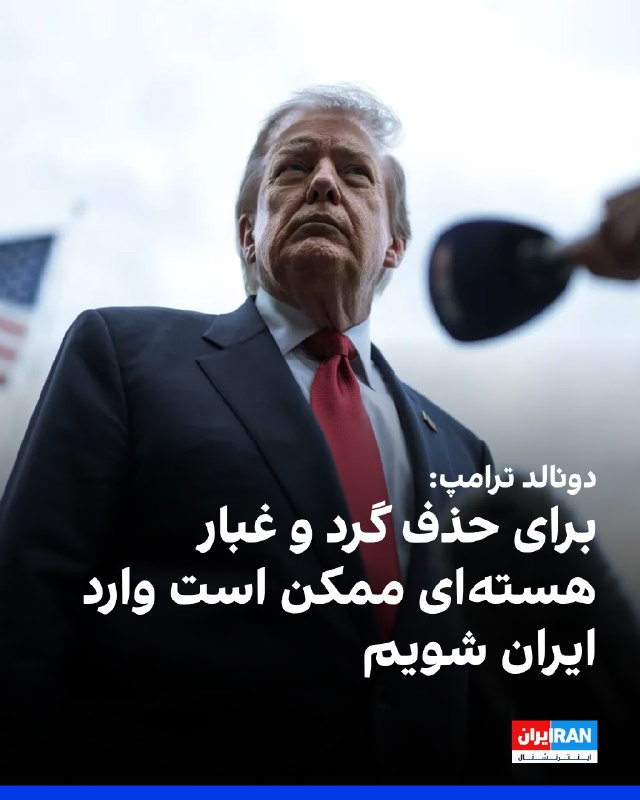
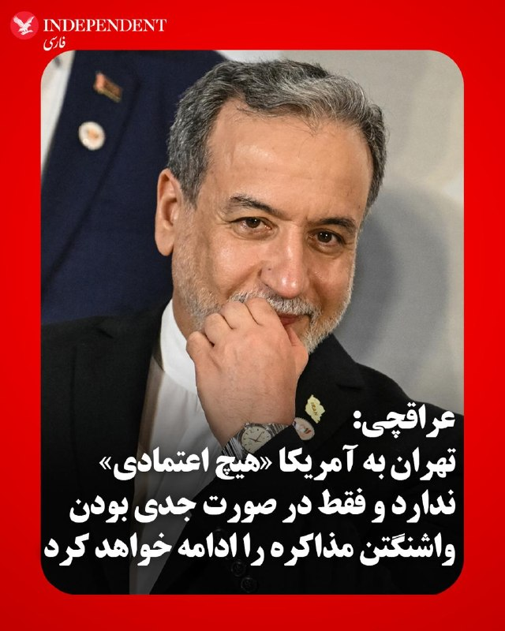
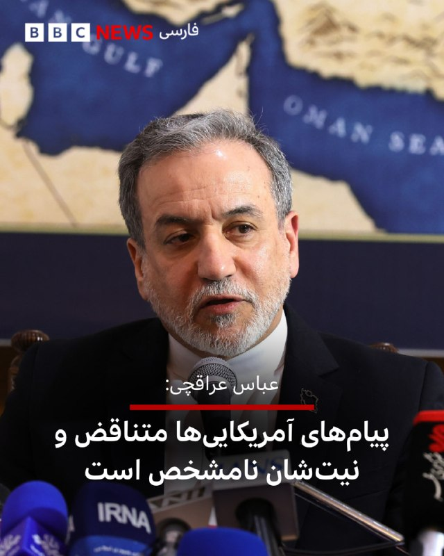

# خواننده تلگرام

<!-- TOP_NAV START -->

<a href="https://github.com/ItIsBillyTheKid/aio-downloader/blob/main/telegram/content/archive_1.md" style="display:inline-block; padding:6px 12px; margin:0 4px; background-color:#2ea44f; color:white; text-decoration:none; border-radius:4px; font-weight:bold;">صفحه بعد</a>

<!-- TOP_NAV END -->

<!-- MSG START -->

---
📅 بروزرسانی: 1405/02/25 16:52
---

## VahidOOnLine — post 240314

🗣روایت شما از بحران اقتصادی و زندگی در آتش‌بس- جمعه ۲۵ اردیبهشت:

🔹برای پایان‌نامه مجبور شدم اینترنت پرو بخرم، با مالیاتش شد ۲ میلیون و ۱۷۰ هزار تومان. قبلش هم اشتراک چت‌جی‌پی‌تی و سامانه «شکن» را گرفته بودم ولی جوابگو نبود. چند میلیون باید برای چیزی هزینه کنی که حقته اما ازت گرفتنش.

🔹 از زمان شروع جنگ تا الان قطعی اینترنت کلی هزینه اضافی رو دستمون گذاشته. ۱۰ گیگ یک ماهه خریدم، ولی ظرف دو هفته تمام شد.

🔹 من اختلال دوقطبی دارم و باید دارو مصرف گنم اما داروهای اعصاب و روان به‌شدت گران و نایاب شده و این موضوع من را به‌شدت نگران کرده، چون تاثیر بدی در روند درمانم دارد.

🔹 مغازه‌ام در پاساژ ارغوان بود که ۱۵ اردیبهشت سوخت و هیچی ازش نموند. حکومت تلاشی برای خاموش کردن آتش نکرد. من و کسبه ارغوان از کجا می‌خواهیم الان کار کنیم، جنس بخریم و تو این وضعیت خرج خونه دربیاریم؟

🔹 من یک زن ۲۵ ساله هستم. سال‌ها امیدم این بود که یک روز مهاجرت می‌کنم و برای همان تلاش کردم. الان با این وضعیت که آیلتس دیگر در ایران برگزار نمی‌شود، اینترنت قطع شده و همه‌چیز ۱۰ برابر گران‌تر شده، حتی نمی‌دانم دیگر به چه آینده‌ای دل ببندم. تمام آرزوهایی که داشتم یکی‌یکی ازم گرفته شدند و الان فقط به این فکر می‌کنم که هفته بعد چطور پولم را نگه دارم که به آخر ماه برسد و چطور قسطی دستمال کاغذی و گوشت و روغن بخرم.

🔹 گناه ما چیست که نمی‌توانیم مثل بقیه آدم‌های این دنیا یک زندگی عادی داشته باشیم؟ برای خوشبختی‌های ساده باید فقط از تخیلاتمان استفاده کنیم. تمام دوستام کارشان با اینترنت بود و الان کارشان را از دست دادند و همه اطرافیانم فقط منتظرند ببینند «چی می‌شه». تا کی باید در این برزخ زندگی کنیم؟
‌🏁 🇬🇧 IranintlTV

🤖 @VahidOOnLine

## VahidOOnLine — post 240313

  

دونالد ترامپ گفت آمریکا ممکن است در مقطعی برای حذف آنچه «گرد و غبار هسته‌ای» نامید وارد ایران شود. ترامپ در مسیر بازگشت به آمریکا و در هواپیمای ریاست‌جمهوری، ایر فورس وان، به خبرنگاران گفت: «در زمان مناسب، یا وارد می‌شویم یا آن را به دست می‌آوریم. فکر می‌کنم احتمالا آن را به دست می‌آوریم، اما اگر به دست نیاوریم، وارد خواهیم شد.»

او افزود: «فکر می‌کنم آنها کاملا شکست خواهند خورد و ما هیچ خطری نخواهیم داشت. ما تجهیزات لازم برای خارج کردن آن را داریم، هیچ‌کس دیگر ندارد؛ شاید چین چنین تجهیزاتی داشته باشد.»

ترامپ پیش‌تر نیز در ماه مارس در کاخ سفید درباره ذخایر اورانیوم غنی‌شده جمهوری اسلامی هشدار مشابهی داده و گفته بود: «یا آن را از آنها پس می‌گیریم یا آن را برمی‌داریم.»
‌🏁 🇬🇧 IranintlTV

🤖 @VahidOOnLine

## VahidOOnLine — post 240312

  

احمد علم‌الهدی، امام جمعه مشهد گفت: «آمریکا اگر بخواهد جنگ را ادامه بدهد، قطعا شکست بیشتری عاید او می‌شود، چون امروز قدرت و توان ما با روز اول جنگ خیلی تفاوت دارد، اگرچه ما در روز اول جنگ کمی غافلگیر شدیم اما اکنون رزمندگان ما آماده‌تر شدند و مسلما شکست آمریکا از اول بیشتر خواهد بود و کمتر نیست.»

او افزود: «در این جنگ ثابت شد که پدافند آمریکایی اصلا کارآمد نیست و حتی نتوانست یکی از موشک‌های ما را رهگیری کند، موشک‌های ما نیز با موفقیت به محل مورد نظر اصابت می‌کرد.»

او ادامه داد: «رزمندگان ما توانستند یک ابرقدرت روی کره زمین را به زانو درآورند و از مقام ابرقدرتی ساقط کنند.»
‌🏁 🇬🇧 IranintlTV

🤖 @VahidOOnLine

## VahidOOnLine — post 240311

  <a href="telegram/content/VahidOOnLine_240311_1778851343.mp4" target="_blank">🎬 Download video</a>

♦️دونالد ترامپ، رئیس‌جمهوری ایالات متحده، روز جمعه ۲۵ اردیبهشت در مسیر بازگشت از چین در پاسخ به خبرنگاران، درباره آخرین پیشنهاد ایران در مذاکرات هسته‌ای گفت که آن را «از همان جمله اول» رد کرده است.
او با بیان اینکه محتوای ابتدایی این پیشنهاد «غیرقابل قبول» بوده، افزود: «حتی ادامه آن را هم نخواندم.» ترامپ تأکید کرد که صرف تعیین بازه زمانی مانند ۲۰ سال کافی نیست و آنچه اهمیت دارد، ارائه تضمین‌های واقعی و قابل اجرا از سوی ایران است.
رئیس‌جمهوری آمریکا همچنین تصریح کرد که، هرگونه توافق باید شامل انتقال کامل مواد و سوخت هسته‌ای از ایران باشد و افزود که توافقی مبتنی بر «حرف‌های توخالی» قابل پذیرش نخواهد بود.
‌🇸🇦 Indypersian

🤖 @VahidOOnLine

## VahidOOnLine — post 240310

  

♦️ مجتبی خامنه‌ای، سومین رهبر جمهوری اسلامی، در پیامی کتبی به مناسبت روز بزرگداشت فردوسی، با زبانی آمیخته به مفاهیم اسطوره‌ای و ایدئولوژیک، بر پیوند میان «هویت ایرانی» و «تمدن اسلامی» تاکید کرد. او در این پیام با اشاره به آنچه «دفاع مقدس سوم» نامید، مدعی شد که مردم ایران در جنگ اخیر نیز همچون درگیری‌های پیشین، واقعیتِ «داستان‌های قهرمانانه شاهنامه» را رقم زده‌اند.

مجتبی خامنه‌ای که از زمان هدف قرار گرفتن در حملات آمریکا و اسرائیل، دیده نشده و صدایی نیز از او شنیده نشده است، در بخشی از پیام خود، متجاوزان را «ضحاک‌وشان» نامید و حفظ استقلال کشور را در گرو مبارزه با آن‌ها دانست. او همچنین با حمله به «سبک زندگی آمریکایی»، خواستار مقابله با «تهاجم زبانی و فرهنگی» غرب شد و از اهالی هنر خواست تا با «بعثت فکری»، روایتِ به گفته او «خیزش ملت» را ماندگار کنند.

استفاده از نمادهای ملی‌گرایانه نظیر شاهنامه و فردوسی، بعد از اولین حمله مستقیم اسرائیل در سال ۱۴۰۴ در ادبیات رسمی رهبران جمهوری اسلامی رواج یافته است.
‌🇸🇦 Indypersian

🤖 @VahidOOnLine

## VahidOOnLine — post 240309

  

فریدریش مرز، صدراعظم آلمان، روز جمعه اعلام کرد پس از سفر دونالد ترامپ به چین با او تماس تلفنی داشته و دو طرف درباره ضرورت بازگشت جمهوری اسلامی به میز مذاکره توافق کرده‌اند.

مرز گفت در این گفت‌وگو تاکید شده است که جمهوری اسلامی باید تنگه هرمز را باز کند و نباید اجازه داده شود به سلاح هسته‌ای دست یابد.

صدراعظم آلمان در پیام‌هایی در شبکه ایکس افزود او و ترامپ همچنین درباره دستیابی به راه‌حل مسالمت‌آمیز برای اوکراین گفت‌وگو کرده و پیش از نشست ناتو در آنکارا مواضع خود را هماهنگ کرده‌اند.

او تاکید کرد ایالات متحده و آلمان شریکانی قدرتمند در چارچوب ناتوی قدرتمند هستند.
‌🏁 🇬🇧 IranintlTV

🤖 @VahidOOnLine

## VahidOOnLine — post 240308

🗣روایت شما از بحران اقتصادی و زندگی در آتش‌بس- جمعه ۲۵ اردیبهشت:

🔹در وضعیت بدی قرار داریم اما در حال حاضر کاری از دست ما برنمیاد جز صبور بودن و منتظر زمان درست بودن. با این سفره‌های خالی و جنایات انقلاب شیر و خورشید، مردم از قبل بیشتر عصبانی شده‌اند و این عصبانیت یک روزی از یک جایی بیرون خواهد زد.

🔹از اصفهان پیام می‌دم من یه جوان ۲۵ ساله‌ام با شغل فنی که دیگه امیدی به آینده‌م ندارم. هر چقدر بیشتر کار می‌کنم کمتر درآمد دارم. با وام و قرض گرفتن ابزار کار خریدم که کار کنم ولی الان ۳ ماهه که بیکارم. فکر کنم تا چند وقت دیگه یا باید برم زندان یا متواری بشم.

🔹مردم از بی اینترنتی خسته شدن، قیمت کانفیگ‌ها بسیار بالاست. گرونی بی‌داد می‌کنه. یک نوشابه ۱.۵ لیتری ۱۱۰ هزار تومانه، لیوان یک بار مصرف به‌شدت گران شده.

🔹ما کشاورزیم، اوضاع برامون خیلی سخت شده، قیمت یک کیسه کود شیمیایی فسفات به ۱۰ میلیون تومان رسیده.

🔹برای اکثر معلولان ماهیانه تنها دو میلیون و ۱۰۰ هزار تومان به عنوان مستمری یا کمک مالی واریز می‌شه که برای تهیه ارزان‌ترین غذا (تخم‌مرغ) هم کافی نیست.

🔹در ایلام اوضاع خیلی خیلی خرابه. اگه در همه شهرها گرونی و کمبود خیلی چیزا هست اما این‌جا وضعیت در حد سونامی و انفجاره. کرایه خونه تو ایلام ۱۲۰ برابر شده. صاحبخونه ۱۰ روز بهم فرصت داده خونه رو خالی کنم اما جایی رو پیدا نمی‌کنم.

🔹یک قوطی رنگ روغن اول اردیبهشت در مشهد ۴۰۰ هزار تومان بود امروز شده ۶۵۰ هزار تومان.
‌🏁 🇬🇧 IranintlTV

🤖 @VahidOOnLine

## VahidOOnLine — post 240307

  <a href="telegram/content/VahidOOnLine_240307_1778851347.mp4" target="_blank">🎬 Download video</a>

وزارت خارجه آمریکا اعلام کرد این کشور در عملیاتی محرمانه، حدود ۱۳ و نیم کیلوگرم اورانیوم غنی‌شده را از یک رآکتور تحقیقاتی تعطیل‌شده در ونزوئلا خارج کرده است.

بر اساس اعلام وزارت خارجه آمریکا، این عملیات به رهبری واشینگتن و با همکاری شرکای بین‌المللی انجام شد و هدف آن کاهش خطر سوءاستفاده از مواد هسته‌ای و تقویت امنیت هسته‌ای عنوان شده است.

اداره ملی امنیت هسته‌ای آمریکا، وابسته به وزارت انرژی، نیز اعلام کرده است همه اورانیوم غنی‌شده باقی‌مانده از یک رآکتور تحقیقاتی قدیمی در ونزوئلا خارج شده است. این نهاد گفت این عملیات در چند ماه انجام شد، در حالی که در شرایط عادی ممکن بود سال‌ها طول بکشد.
‌🏁 🇬🇧 ManotoTV

🤖 @VahidOOnLine

## VahidOOnLine — post 240306

  <a href="telegram/content/VahidOOnLine_240306_1778851347.mp4" target="_blank">🎬 Download video</a>

یک شهروند در پیامی به ایران اینترنشنال با اشاره به قطع روزانه برق در فردیس استان البرز خطاب به مخالفان حمله نظامی به جمهوری اسلامی می‌پرسد:‌ این بود زیرساخت‌ها؟» پیام این مخاطب با هوش مصنوعی خوانده شده است.
‌🏁 🇬🇧 IranintlTV

🤖 @VahidOOnLine

## VahidOOnLine — post 240305

  <a href="telegram/content/VahidOOnLine_240305_1778851350.mp4" target="_blank">🎬 Download video</a>

دونالد ترامپ در پاسخ به پرسشی درباره پیشنهاد اخیر جمهوری اسلامی گفت این پیشنهاد را بررسی کرده، اما به گفته او، اگر از جمله نخست یک متن خوشش نیاید، بقیه آن را کنار می‌گذارد.

ترامپ در پاسخ به این پرسش که جمله نخست چه بوده است، آن را «غیرقابل قبول» توصیف کرد و گفت مسئله اصلی از نگاه او این است که ایران نباید «هیچ شکل» از برنامه هسته‌ای داشته باشد.

در ادامه، خبرنگار از ترامپ پرسید آیا دوره ۲۰ ساله برای او کافی نیست. ترامپ پاسخ داد که «۲۰ سال کافی است»، اما به گفته او، سطح تضمین‌هایی که جمهوری اسلامی ارائه می‌دهد اهمیت دارد.

ترامپ گفت که اگر قرار است توافقی ۲۰ ساله مطرح باشد، باید «۲۰ سال واقعی» باشد و نباید به گفته او، توافقی مبهم یا ظاهری باشد.
‌🏁 🇬🇧 ManotoTV

🤖 @VahidOOnLine

## VahidOOnLine — post 240304

  <a href="telegram/content/VahidOOnLine_240304_1778851351.mp4" target="_blank">🎬 Download video</a>

دونالد ترامپ در پاسخ به پرسشی درباره اینکه آیا شی جین‌پینگ، رئیس‌جمهوری چین، تعهدی قاطع برای فشار بر جمهوری اسلامی به منظور بازگشایی تنگه هرمز داده است، گفت از کسی «درخواست لطف» نمی‌کند.

ترامپ گفت: «من درخواست هیچ لطفی نمی‌کنم، چون وقتی درخواست لطف می‌کنید، باید در مقابل لطفی انجام دهید.» او افزود که آمریکا به چنین کمکی نیاز ندارد.

رئیس‌جمهوری آمریکا در ادامه گفت نیروهای مسلح طرف مقابل «اساسا از بین رفته‌اند» و ممکن است به گفته او «کمی کار پاکسازی» لازم باشد. او همچنین به آتش‌بس اشاره کرد و گفت این آتش‌بس به درخواست کشورهای دیگر انجام شد.

ترامپ گفت شخصا چندان موافق آتش‌بس نبوده، اما آن را به عنوان لطفی به پاکستان پذیرفته است. او از مقام‌های پاکستانی، از جمله نخست‌وزیر و فیلدمارشال این کشور، با تعبیر «افرادی فوق‌العاده» یاد کرد.
‌🏁 🇬🇧 ManotoTV

🤖 @VahidOOnLine

## VahidOOnLine — post 240303

  <a href="telegram/content/VahidOOnLine_240303_1778851353.mp4" target="_blank">🎬 Download video</a>

«انتقام خون بچه‌ها رو می‌گیریم»
‌🏁 🇬🇧 ManotoTV

🤖 @VahidOOnLine

## VahidOOnLine — post 240302

  <a href="telegram/content/VahidOOnLine_240302_1778851355.mp4" target="_blank">🎬 Download video</a>

«صدای فاطمه سپهری باشیم»
‌🏁 🇬🇧 ManotoTV

🤖 @VahidOOnLine

## VahidOOnLine — post 240301

  <a href="telegram/content/VahidOOnLine_240301_1778851357.mp4" target="_blank">🎬 Download video</a>

عباس عراقچی، وزیر خارجه جمهوری اسلامی، در حاشیه نشست بریکس در هند گفت روند میانجیگری پاکستان هنوز شکست نخورده، اما «در مسیری بسیار دشوار» قرار دارد.

عراقچی در نشست خبری خود گفت دشواری این روند عمدتا به دلیل «رفتار آمریکایی‌ها» است. وزیر خارجه جمهوری اسلامی پیش‌تر نیز گفته بود «پیام‌های متناقض» آمریکا یکی از موانع اصلی در مسیر گفتگوهاست.
‌🏁 🇬🇧 ManotoTV

🤖 @VahidOOnLine

## VahidOOnLine — post 240300

  

رسیدگی به پرونده سه متهم حمله به پارکینگی در مجاورت دفتر ایران‌اینترنشنال در لندن آغاز شده است. بر اساس حکم دادگاه مقدماتی، متهمان قرار است بهمن‌ماه محاکمه شوند. جلسه محاکمه مقدماتی این سه نفر ساعت ۱۰ صبح (به وقت محلی) جمعه ۲۵ اردیبهشت در دادگاه کیفری مرکزی انگلستان، موسوم به اولد بیلی، به ریاست قاضی چیما گراب برگزار شد.

بر اساس حکم جلسه مقدماتی، متهمان ۲۵ ژانویه ۲۰۲۷ (پنجم بهمن ۱۴۰۵) در دادگاه کیفری مرکزی محاکمه خواهند شد.

این سه نفر که شهروند بریتانیا هستند، ماه گذشته در دادگاه مجیستریت وست‌مینستر حضور یافته بودند.

دو متهم بزرگسال این پرونده اویسین مک‌گینس ۲۱ ساله و ناتان دان ۱۹ ساله هستند. متهم سوم یک پسر ۱۵ ساله است که به‌دلیل ملاحظات قانونی نامش فاش نخواهد شد.

هر سه نفر با اتهام «آتش‌سوزی عمدی به قصد به خطر انداختن جان افراد» روبه‌رو هستند. مک‌گینس علاوه بر این، به «رانندگی خطرناک» حین تعقیب پلیس نیز متهم شده است.
‌🏁 🇬🇧 IranintlTV

🤖 @VahidOOnLine

## VahidOOnLine — post 240299

  

⭕️ترامپ: مخالفتی با تعلیق ۲۰ ساله غنی‌سازی اورانیوم ایران ندارم ولی باید تعهد واقعی باشد

♦️دونالد ترامپ رئیس جمهوری ایالات متحده روز جمعه ۲۵ اردیبهشت و در زمان بازگشت از چین در هواپیمای ایرفورس وان به خبرنگاران گفت که مشکلی با تعلیق غنی‌سازی اورانیوم ایران به‌مدت ۲۰ سال ندارد اما این تعهد باید واقعی باشد.

ترامپ پیشتر گفته بود ایران دیگر هرگز نباید غنی‌سازی اورانیوم داشته باشد.

براساس گزارش‌های غیر رسمی مقام‌های جمهوری اسلامی بارها تاکید کرده‌اند که حداکثر غنی‌سازی ۵ ساله را می‌پذیرند. این در حالی است که اخیرا چند عضو مجلس شورای اسلامی گفته‌اند که تهران به‌هیچ وجه بحث تعلیق را نمی‌پذیرد.
‌🇸🇦 Indypersian

🤖 @VahidOOnLine

## VahidOOnLine — post 240298

  

شبکه کان اسرائیل گزارش داد ایال زمیر، رییس ستاد کل ارتش اسرائیل، در جریان جنگ علیه جمهوری اسلامی، به امارات متحده عربی سفر کرد. بر اساس این گزارش، زمیر در این سفر با مقام‌های اماراتی، از جمله محمد بن زاید آل نهیان، رییس این کشور، دیدار و گفت‌وگو کرده است.
‌🏁 🇬🇧 IranintlTV

🤖 @VahidOOnLine

## VahidOOnLine — post 240297

  

♦️عباس عراقچی، وزیر امور خارجه جمهوری اسلامی ایران، اعلام کرد تهران «هیچ اعتمادی» به ایالات متحده ندارد و فقط در صورتی به مذاکره با واشنگتن علاقه‌مند است که آمریکا در رویکرد خود «جدی» باشد.
عراقچی روز جمعه در جمع خبرنگاران در دهلی‌نو گفت پیام‌های متناقض آمریکا باعث شده ایران نسبت به نیت واقعی واشنگتن در مذاکرات تردید داشته باشد.
او همچنین درباره روند میانجی‌گری پاکستان گفت این روند شکست نخورده اما با «دشواری» مواجه شده است.
عراقچی تاکید کرد ایران تلاش می‌کند آتش‌بس فعلی حفظ شود تا فرصتی برای دیپلماسی فراهم شود، اما همزمان برای بازگشت به درگیری نیز آمادگی دارد.
اظهارات وزیر خارجه ایران چند ساعت پس از آن مطرح شد که دونالد ترامپ اعلام کرد صبرش در قبال ایران رو به پایان است و گفت در گفتگو با شی جین‌پینگ درباره لزوم بازگشایی تنگه هرمز توافق کرده است.
‌🇸🇦 Indypersian

🤖 @VahidOOnLine

## WithYashar — post 11291

  <a href="telegram/content/WithYashar_11291_1778851362.mp4" target="_blank">🎬 Download video</a>

خبرنگار: دیروز از دریادار کوپر درباره حمله به مدرسه دخترانه(میناب)در روز اول جنگ سؤال شد.
ترامپ: منظورتون همون حمله اولیه‌ست؟ اون موضوع هنوز تحت تحقیق قرار داره.
خبرنگار: می‌تونید تأیید کنید که موشک آمریکایی بوده؟
ترامپ: شما از کدوم رسانه‌ای هستید؟
خبرنگار: بی‌بی‌سی.
ترامپ: بی‌بی‌سی فیکه با من حرف نزن.
@withyashar

## WithYashar — post 11290

  <a href="telegram/content/WithYashar_11290_1778851364.mp4" target="_blank">🎬 Download video</a>

🥲 @withyashar

## WithYashar — post 11289

  <a href="telegram/content/WithYashar_11289_1778851366.mp4" target="_blank">🎬 Download video</a>

امروز 25 اردیبهشت روز پاسداشت زبان فارسی و بزرگداشت فردوسیه
@withyashar

## WithYashar — post 11288

  <a href="telegram/content/WithYashar_11288_1778851368.mp4" target="_blank">🎬 Download video</a>

روانه شدن نفت در سواحل جزایر خلیج فارس جمهموری اسلامی داره نفتو تو دریا میریزه و جان موجودات دریایی و زیست بوم ها رو به خطر انداخته
@withyashar

## mwarmonitor — post 9130

📝 سوالی دارید دایرکت جواب میدم

## mwarmonitor — post 9129

  

🇺🇸یک بالگرد MH-60R Sea Hawk از عرشه ناو جنگی USS Rafael Peralta (DDG 115) در حالی که نیروهای آمریکایی در دریای عرب در حال اجرای محاصره دریایی علیه ایران هستند، برخاست. تا امروز، ۷۵ کشتی تجاری منحرف شده و ۴ کشتی برای تضمین رعایت مقررات از کار افتاده‌اند.

@mwarmonitor

## mwarmonitor — post 9128

🇺🇸فرمانده سنتکام: عملیات «خشم حماسی» ایران را فلج و مشارکت‌های نظامی در منطقه را تقویت کرد

وزارت جنگ ایالات متحده 🇺🇸

🔸به گفته رهبران وزارت جنگ، ایالات متحده در اواخر فوریه عملیات «خشم حماسی» (Epic Fury) را آغاز کرد و از آن زمان، نیروهای نظامی آمریکا در منطقه عملیاتی فرماندهی مرکزی (سنتکام)، توان نظامی ایران و قدرت نفوذ آن را فلج کرده‌اند. این عملیات همچنین نقش شرکای نظامی در منطقه را برجسته کرد.

دریاسالار برد کوپر، فرمانده سنتکام، امروز در واشینگتن در برابر کمیته نیروهای مسلح سنا شهادت داد. این جلسه بخشی از بررسی‌های مربوط به وضعیت نیروها در منطقه و بخش مربوط به این فرماندهی در درخواست بودجه ریاست‌جمهوری برای سال مالی ۲۰۲۷ بود. محور اصلی گفتگوها در کپیتال هیل بر موفقیت‌های عملیات «خشم حماسی» متمرکز بود.
کوپر خطاب به قانون‌گذاران گفت: «در کمتر از ۴۰ روز، نیروهای سنتکام به اهداف نظامی خود دست یافتند. قابل‌توجه‌ترین دستاورد این بود که ما توانایی ایران برای صدور قدرت به خارج از مرزهایش و تهدید منطقه و منافعمان را تضعیف کردیم.»
کوپر به یاد قانون‌گذاران آورد که در آوریل و اکتبر سال گذشته، ایران صدها موشک را بر سر اسرائیل فرود آورد؛ اما اکنون پس از آنکه نیروهای آمریکایی به‌طور مؤثری ظرفیت موشک‌های متعارف ایران را از بین بردند، این کشور دیگر چنین توانایی ندارد.
او گفت: «امروز ایران دیگر نمی‌تواند با آن حجم و مقیاس حمله کند. علاوه بر این، با نابودی ۹۰ درصد از پایگاه‌های صنایع دفاعی ایران، این کشور تا سال‌ها قادر به بازسازی آن سلاح‌ها نخواهد بود.»
اهداف راهبردی و نابودی توان نظامی
رئیس‌جمهور دونالد جی. ترامپ و دیگر مقامات دولت تصریح کرده‌اند که ایرانی‌ها هرگز به سلاح هسته‌ای دست نخواهند یافت. کوپر بیان کرد که اهداف نظامی در قالب عملیات «خشم حماسی» برای حمایت از این سیاست طراحی شده بود؛ از جمله تضعیف توانمندی موشک‌های بالستیک و نیروی دریایی ایران و همچنین نابودی توانایی صنایع این کشور برای بازسازی این تجهیزات.
صنایع دفاعی: ۹۰ درصد از زیرساخت‌های پهپادی، موشکی و دریایی تخریب شده و تنها ۱۰ درصد باقی مانده است.
نیروی دریایی: طبق ارزیابی نظامی، بازسازی نیروی دریایی ایران ۵ تا ۱۰ سال زمان خواهد برد.
گروه‌های نیابتی: حماس، حزب‌الله و حوثی‌ها به دلیل این عملیات، از تدارکات تسلیحاتی و پشتیبانی ایران قطع شده‌اند.
تقویت ائتلاف‌های منطقه‌ای
کوپر به قانون‌گذاران گفت که در حال حاضر هیچ منبع یا تجهیزاتی از ایران به سمت گروه‌های تروریستی نیابتی سرازیر نمی‌شود. او تأکید کرد که آغاز عملیات «خشم حماسی» نشان داد شرکای منطقه‌ای تا چه حد توانمند هستند و این عملیات باعث تقویت روابط نظامی شده است.
او افزود: «در حال حاضر، ما پنج کشور متحد خاص داریم که نه تنها در تئوری، بلکه در عمل شانه به شانه ایالات متحده در امور دفاعی ایستاده‌اند.»
شرکای کلیدی مورد تقدیر:
امارات متحده عربی، بحرین، کویت، قطر و عربستان سعودی (به عنوان شرکای استثنایی).
پادشاهی اردن (نقش حیاتی در موفقیت عملیات).

🔴دولت اسرائیل (همکاری بسیار نزدیک).
کوپر در پایان خاطرنشان کرد: «این نتیجه از پیش تعیین شده نبود و بر حسب تصادف به دست نیامد؛ بلکه حاصل ماه‌ها برنامه‌ریزی دقیق بر پایه دهه‌ها تجربه است.»

@mwarmonitor

## mwarmonitor — post 9127

تموم شد 😮‍💨

## mwarmonitor — post 9126

🔹خبرنگار: آقا، باز هم در مورد رئیس‌جمهور شی (رئیس‌جمهور چین)؛ چند سال پیش وقتی رئیس‌جمهور بایدن در سانفرانسیسکو با او ملاقات کرد، از او پرسیده شد که آیا فکر می‌کند رئیس‌جمهور شی یک دیکتاتور است یا خیر. آیا شما فکر می‌کنید رئیس‌جمهور شی یک دیکتاتور است؟ 🔸ترامپ:…

## mwarmonitor — post 9125

🔹خبرنگار: «فکر می‌کنید "شی" (رئیس‌جمهور چین) در معاملاتش با شما، نسبت به آخرین باری که با هم در ارتباط بودید، احساس قدرت بیشتری می‌کرد؟ قبل از اینکه کووید سر و کله‌اش پیدا شود...» 🔸ترامپ: «خب، من آن‌ها را بابت آن (کووید) مقصر دانستم. گفتم که کارِ "ووهان" بود…

## mwarmonitor — post 9124

🔹خبرنگار: «در مورد معاملات با چین چطور؟ آیا در مورد سویا به توافقی رسیدید؟ می‌دانید که کشاورزان...» 🔸ترامپ: «بله، کشاورزان خیلی خوشحال خواهند شد. آن‌ها قرار است میلیاردها دلار سویا بخرند. بله.» 🔹خبرنگار: «آقای رئیس‌جمهور، داشتیم در مورد بریتانیا صحبت می‌کردیم،…

## mwarmonitor — post 9123

🔸ترامپ: نمی‌خوام این رو بگم. یعنی دوست دارم بهتون بگم. دوست دارم بگم در یک ساعت خاص، در یک روز خاص، بمباران قراره... [اما] نمی‌خوام این رو بگم. فقط می‌تونم بگم که ایران... این رو با اطمینان بسیار بسیار قوی می‌تونم بگم... ایران هرگز سلاح هسته‌ای نخواهد داشت.…

## FoxNewsTwitter — post 341770

  <a href="telegram/content/FoxNewsTwitter_341770_1778851371.mp4" target="_blank">🎬 Download video</a>

Fox News (Twitter/X)

NEW: President Trump unleashes on Democratic Senate candidate James Talarico, labeling the Texas politician "pathetic" and "bad news" for the Lone Star State.

"I think the Democrats have a weird, a weird candidate. I mean, this guy is bad news.”

## FoxNewsTwitter — post 341769

  <a href="telegram/content/FoxNewsTwitter_341769_1778851373.mp4" target="_blank">🎬 Download video</a>

Fox News (Twitter/X)

NEW: President Trump clashes with a reporter on Air Force One during a feisty exchange about the U.S. military action in Iran as well as the regime's current capabilities:

"I had a total military victory. But the fake news guys like you write incorrectly. You're a fake guy. And guys like you write about it incorrectly. We had a total military victory. We knocked out their entire navy. We knocked out their entire Air force."

## pm_afshaa — post 90791

  <a href="telegram/content/pm_afshaa_90791_1778851376.webm" target="_blank">🎬 Download video</a>

🔴سنتکام: تا امروز، 75 کشتی تجاری تغییر مسیر دادن و 4 کشتی غیرفعال شده تا اطمینان حاصل بشه که قوانین رعایت میشه.

💧 Rainbet.com the #1 Non-KYC Crypto Casino & Sportsbook @rainbetcom

😁 @Pm_Afshaa

## pm_afshaa — post 90790

  <a href="telegram/content/pm_afshaa_90790_1778851376.webm" target="_blank">🎬 Download video</a>

🔴تهران‌تایمز: آمریکا پیشنهاد 14 ماده‌ای جمهوری اسلامی برای پایان جنگ رو رد کرده و بار دیگر بر مواضع خود، به‌ویژه درباره پرونده هسته‌ای، تأکید کرده.

💧 Rainbet.com the #1 Non-KYC Crypto Casino & Sportsbook @rainbetcom

😁 @Pm_Afshaa

## pm_afshaa — post 90789

🔴دقایقی پیش ترامپ رسماً اعلام کرد که یه دور دیگر از عملیات نظامی آمریکا در ایران در راه است

+ترامپ:ما همه چیز را تمام نکردیم،
برمی‌گردیم و آن را تکمیل می‌کنیم،
حتی شاید بیشتر

💧 Rainbet.com the #1 Non-KYC Crypto Casino & Sportsbook @rainbetcom

😁 @Pm_Afshaa

## pm_afshaa — post 90788

♨️
♨️
♨️
♨️

## pm_afshaa — post 90787

  <a href="telegram/content/pm_afshaa_90787_1778851377.webm" target="_blank">🎬 Download video</a>

🔴ترامپ به فاکس‌نیوز: ما میتونستیم پل‌ها و شبکه‌های برق ایران رو نابود کنیم و میتونیم ظرف دو روز همه چیز رو در آنجا از بین ببریم.

💧 Rainbet.com the #1 Non-KYC Crypto Casino & Sportsbook @rainbetcom

😁 @Pm_Afshaa

## pm_afshaa — post 90786

  <a href="telegram/content/pm_afshaa_90786_1778851378.webm" target="_blank">🎬 Download video</a>

🔴بلومبرگ: امارات تلاش کرد عربستان و قطر رو برای مشارکت در یک پاسخ نظامی مشترک علیه جمهوری اسلامی همراه کنه، اما هر دو کشور این درخواست رو رد کردن.

💧 Rainbet.com the #1 Non-KYC Crypto Casino & Sportsbook @rainbetcom

😁 @Pm_Afshaa

## pm_afshaa — post 90785

امروز 25 اردیبهشت روز پاسداشت زبان فارسی و بزرگداشت فردوسیه 
💧 Rainbet.com the #1 Non-KYC Crypto Casino & Sportsbook @rainbetcom 
😁 @Pm_Afshaa

## DEJradio — post 4650

  <a href="telegram/content/DEJradio_4650_1778851379.webm" target="_blank">🎬 Download video</a>

🚨
⭕️ شش کشور عربی با شکایت از جمهوری اسلامی به شورای امنیت خواستار دریافت غرامت از تهران شدند

شش کشور عربی حوزه خلیج فارس در نامه‌ای به شورای امنیت سازمان ملل ادعای حکومت ایران درباره اداره یا وضع قواعد جدید برای تنگه هرمز را محکوم کردند. امارات متحده عربی نیز در نامه‌ای جداگانه به همین نهاد، جمهوری اسلامی را به حملات «عامدانه» به زیرساخت‌های حیاتی و غیرنظامی متهم کرد.
نسخه‌هایی از هر دو نامه در اختیار خبرنگار ایران‌اینترنشنال در سازمان ملل متحد قرار گرفته است.

خبرگزاری بنا، رسانه رسمی دولت بحرین، نیز پنج‌شنبه ۲۴ اردیبهشت اعلام کرد که این کشور همراه با امارات متحده عربی، عربستان سعودی، کویت، قطر و اردن در نامه‌ای فوری به دبیرکل سازمان ملل و شورای امنیت نسبت اظهارات مقام‌های جمهوری اسلامی درباره «مدیریت» تنگه هرمز و ایجاد «قوانین حقوقی» تازه برای این آبراه بین‌المللی را رد و محکوم کردند.

در این نامه، بر حق تمام این کشورها به «اتخاذ تصمیم‌های مشروع حاکمیتی در زمینه امنیت و مشارکت‌های بین‌المللی خود» تاکید شده است.
این کشورها نوشته‌اند که تنگه هرمز «یک آبراه بین‌المللی حیاتی برای کشتیرانی، تجارت و انرژی» است و هیچ کشوری، صرف‌نظر از موقعیت جغرافیایی‌اش، حق ندارد به‌تنهایی برای آن «اداره یک‌جانبه» یا «قواعد حقوقی منفرد» وضع کند.

#شورای_امنیت_سازمان_ملل #تنگه_هرمز
@DEJradio

## DEJradio — post 4649

  <a href="telegram/content/DEJradio_4649_1778851379.mp4" target="_blank">🎬 Download video</a>

🚨
🔸 مستند؛
آمنه‌سادات ذبیح‌پور- خانم خبرنگار دست در دست نیروهای امنیتی

#نیروهای_امنیتی #بازجو_خبرنگار
@DEJradio

## mamlekate — post 103528

  <a href="telegram/content/mamlekate_103528_1778851382.mp4" target="_blank">🎬 Download video</a>

دونالد ترامپ در پاسخ به پرسشی درباره پیشنهاد اخیر جمهوری اسلامی گفت این پیشنهاد را بررسی کرده، اما به گفته او، اگر از جمله نخست یک متن خوشش نیاید، بقیه آن را کنار می‌گذارد.

ترامپ در پاسخ به این پرسش که جمله نخست چه بوده است، آن را «غیرقابل قبول» توصیف کرد و گفت مسئله اصلی از نگاه او این است که ایران نباید «هیچ شکل» از برنامه هسته‌ای داشته باشد.

در ادامه، خبرنگار از ترامپ پرسید آیا دوره ۲۰ ساله برای او کافی نیست. ترامپ پاسخ داد که «۲۰ سال کافی است»، اما به گفته او، سطح تضمین‌هایی که جمهوری اسلامی ارائه می‌دهد اهمیت دارد.

ترامپ گفت که اگر قرار است توافقی ۲۰ ساله مطرح باشد، باید «۲۰ سال واقعی» باشد و نباید به گفته او، توافقی مبهم یا ظاهری باشد.

ManotoTV
@mamlekate

## mamlekate — post 103527

  

📞 سلام مملکته. درباره چندتا از دانشجویان دانشگاه پزشکی بلاروس پیام میدم. سفیر بیشرف جمهوری اسلامی در مینسک علیرضا صانعی مزدور دست نشانده جمهوری اسلامی به وزارت کشور بلاروس یادداشت فرستاده و دانشجویان مقیم و افراد مقیمی که در بلاروس زندگی میکنند و مخالف جمهوری اسلامی هستند را افراد خطرناک برای شهروندان بلاروس و حامی تروریسم معرفی کرده و با پیگیری پی در پی خود و دیپلماتهای سفارت و یادداشت های فراوان خواستار دیپورت این افراد از بلاروس به ایران و دستگیری آنها در ایران میباشد. لطفا صدای مارو به جهانیان برسونید. دولت بلاروس بخاطر یادداشتهای سفارت و ترس از ایجاد مشکلات دیپلماتی مجبور به این اقدام شده است حتی پس از پایان بازداشت بعضی افرادی که آزاد شدند سفیر مجدد پیگیری کرده و خواستار دیپورت آنها شده است. یکی از این افراد خاطره خدادادی و یکی دیگر دکتر سپهر فرشادی که نزدیک به دوهفته در بازداشت انفرادی بسر میبره و در آستانه ی دیپورت میباشد. دوستان دیگه ای هم در همین وضعیت هستند.

@mamlekate

## IranIntlTV — post 337326

🗣روایت شما از بحران اقتصادی و زندگی در آتش‌بس- جمعه ۲۵ اردیبهشت:

🔹برای پایان‌نامه مجبور شدم اینترنت پرو بخرم، با مالیاتش شد ۲ میلیون و ۱۷۰ هزار تومان. قبلش هم اشتراک چت‌جی‌پی‌تی و سامانه «شکن» را گرفته بودم ولی جوابگو نبود. چند میلیون باید برای چیزی هزینه کنی که حقته اما ازت گرفتنش.

🔹 از زمان شروع جنگ تا الان قطعی اینترنت کلی هزینه اضافی رو دستمون گذاشته. ۱۰ گیگ یک ماهه خریدم، ولی ظرف دو هفته تمام شد.

🔹 من اختلال دوقطبی دارم و باید دارو مصرف گنم اما داروهای اعصاب و روان به‌شدت گران و نایاب شده و این موضوع من را به‌شدت نگران کرده، چون تاثیر بدی در روند درمانم دارد.

🔹 مغازه‌ام در پاساژ ارغوان بود که ۱۵ اردیبهشت سوخت و هیچی ازش نموند. حکومت تلاشی برای خاموش کردن آتش نکرد. من و کسبه ارغوان از کجا می‌خواهیم الان کار کنیم، جنس بخریم و تو این وضعیت خرج خونه دربیاریم؟

🔹 من یک زن ۲۵ ساله هستم. سال‌ها امیدم این بود که یک روز مهاجرت می‌کنم و برای همان تلاش کردم. الان با این وضعیت که آیلتس دیگر در ایران برگزار نمی‌شود، اینترنت قطع شده و همه‌چیز ۱۰ برابر گران‌تر شده، حتی نمی‌دانم دیگر به چه آینده‌ای دل ببندم. تمام آرزوهایی که داشتم یکی‌یکی ازم گرفته شدند و الان فقط به این فکر می‌کنم که هفته بعد چطور پولم را نگه دارم که به آخر ماه برسد و چطور قسطی دستمال کاغذی و گوشت و روغن بخرم.

🔹 گناه ما چیست که نمی‌توانیم مثل بقیه آدم‌های این دنیا یک زندگی عادی داشته باشیم؟ برای خوشبختی‌های ساده باید فقط از تخیلاتمان استفاده کنیم. تمام دوستام کارشان با اینترنت بود و الان کارشان را از دست دادند و همه اطرافیانم فقط منتظرند ببینند «چی می‌شه». تا کی باید در این برزخ زندگی کنیم؟

## IranIntlTV — post 337325

  

دونالد ترامپ گفت آمریکا ممکن است در مقطعی برای حذف آنچه «گرد و غبار هسته‌ای» نامید وارد ایران شود. ترامپ در مسیر بازگشت به آمریکا و در هواپیمای ریاست‌جمهوری، ایر فورس وان، به خبرنگاران گفت: «در زمان مناسب، یا وارد می‌شویم یا آن را به دست می‌آوریم. فکر می‌کنم احتمالا آن را به دست می‌آوریم، اما اگر به دست نیاوریم، وارد خواهیم شد.»

او افزود: «فکر می‌کنم آنها کاملا شکست خواهند خورد و ما هیچ خطری نخواهیم داشت. ما تجهیزات لازم برای خارج کردن آن را داریم، هیچ‌کس دیگر ندارد؛ شاید چین چنین تجهیزاتی داشته باشد.»

ترامپ پیش‌تر نیز در ماه مارس در کاخ سفید درباره ذخایر اورانیوم غنی‌شده جمهوری اسلامی هشدار مشابهی داده و گفته بود: «یا آن را از آنها پس می‌گیریم یا آن را برمی‌داریم.»
https://iranintl.com/202605154083

## IranIntlTV — post 337324

  

احمد علم‌الهدی، امام جمعه مشهد گفت: «آمریکا اگر بخواهد جنگ را ادامه بدهد، قطعا شکست بیشتری عاید او می‌شود، چون امروز قدرت و توان ما با روز اول جنگ خیلی تفاوت دارد، اگرچه ما در روز اول جنگ کمی غافلگیر شدیم اما اکنون رزمندگان ما آماده‌تر شدند و مسلما شکست آمریکا از اول بیشتر خواهد بود و کمتر نیست.»

او افزود: «در این جنگ ثابت شد که پدافند آمریکایی اصلا کارآمد نیست و حتی نتوانست یکی از موشک‌های ما را رهگیری کند، موشک‌های ما نیز با موفقیت به محل مورد نظر اصابت می‌کرد.»

او ادامه داد: «رزمندگان ما توانستند یک ابرقدرت روی کره زمین را به زانو درآورند و از مقام ابرقدرتی ساقط کنند.»
https://iranintl.com/202605151888

## IranIntlTV — post 337323

  <a href="telegram/content/IranIntlTV_337323_1778851386.mp4" target="_blank">🎬 Download video</a>

یک شهروند از اراک با ارسال ویدیویی به ایران اینترنشنال می‌گوید یک بسته حاوی سه تکه مرغ که سال گذشته حدود ۳۰۰ تا ۴۰۰ هزار تومان خریداری می‌کرده را ۲۵ اردیبهشت به قیمت یک میلیون و ۲۰۰ هزار تومان خریده است.

## IranIntlTV — post 337322

  <a href="telegram/content/IranIntlTV_337322_1778851388.mp4" target="_blank">🎬 Download video</a>

دونالد ترامپ گفت تعلیق ۲۰ ساله غنی‌سازی اورانیوم در ایران مدنظر است و از هم‌نظری چین با آمریکا درباره برنامه هسته‌ای جمهوری اسلامی سخن گفت. همزمان عباس عراقچی تاکید کرد تهران درباره پرونده هسته‌ای مذاکره نخواهد کرد.
گفت‌وگو با امید شمس، حقوق‌دان و تحلیل‌گر امور بین‌الملل
@iranintltv

## IranIntlTV — post 337321

  <a href="telegram/content/IranIntlTV_337321_1778851391.mp4" target="_blank">🎬 Download video</a>

وزارت امور خارجه ایالات متحده اعلام کرد دومین روز از دور تازه گفت‌وگوها میان نمایندگان لبنان و اسرائیل در ساختمان این وزارتخانه در واشینگتن برگزار می‌شود و فضای مذاکرات «مثبت و سازنده» ارزیابی شده‌ است.
می فرحات، خبرنگار ایران‌اینترنشنال، گزارش می‌دهد
@iranintltv

## IranIntlTV — post 337320

  <a href="telegram/content/IranIntlTV_337320_1778851393.mp4" target="_blank">🎬 Download video</a>

فیلم «داستان‌های موازی» ساخته اصغر فرهادی که در بخش مسابقه جشنواره فیلم کن به نمایش درآمد، روایتگر داستان نویسنده‌ای است که برای الهام گرفتن، زندگی همسایه‌های خانه روبه‌رویی را زیر نظر می‌گیرد. او برای پیشبرد کارش دستیاری استخدام می‌کند، اما ورود این دستیار، مسیر روایت و زندگی شخصیت‌های فیلم را دستخوش تغییر می‌کند.

لی‌لی نیکفر، خبرنگار ایران‌اینترنشنال، گزارش می‌دهد
@iranintltv

## IranIntlTV — post 337319

  

فریدریش مرتس، صدراعظم آلمان، روز جمعه اعلام کرد پس از سفر دونالد ترامپ به چین با او تماس تلفنی داشته و دو طرف درباره ضرورت بازگشت جمهوری اسلامی به میز مذاکره توافق کرده‌اند.

مرتس گفت در این گفت‌وگو تاکید شده است که جمهوری اسلامی باید تنگه هرمز را باز کند و نباید اجازه داده شود به سلاح هسته‌ای دست یابد.

صدراعظم آلمان در پیام‌هایی در شبکه ایکس افزود او و ترامپ همچنین درباره دستیابی به راه‌حل مسالمت‌آمیز برای اوکراین گفت‌وگو کرده و پیش از نشست ناتو در آنکارا مواضع خود را هماهنگ کرده‌اند.

او تاکید کرد ایالات متحده و آلمان شریکانی قدرتمند در چارچوب ناتوی قدرتمند هستند.
https://iranintl.com/202605158703

## IranIntlTV — post 337318

🗣روایت شما از بحران اقتصادی و زندگی در آتش‌بس- جمعه ۲۵ اردیبهشت:

🔹در وضعیت بدی قرار داریم اما در حال حاضر کاری از دست ما برنمیاد جز صبور بودن و منتظر زمان درست بودن. با این سفره‌های خالی و جنایات انقلاب شیر و خورشید، مردم از قبل بیشتر عصبانی شده‌اند و این عصبانیت یک روزی از یک جایی بیرون خواهد زد.

🔹از اصفهان پیام می‌دم من یه جوان ۲۵ ساله‌ام با شغل فنی که دیگه امیدی به آینده‌م ندارم. هر چقدر بیشتر کار می‌کنم کمتر درآمد دارم. با وام و قرض گرفتن ابزار کار خریدم که کار کنم ولی الان ۳ ماهه که بیکارم. فکر کنم تا چند وقت دیگه یا باید برم زندان یا متواری بشم.

🔹مردم از بی اینترنتی خسته شدن، قیمت کانفیگ‌ها بسیار بالاست. گرونی بی‌داد می‌کنه. یک نوشابه ۱.۵ لیتری ۱۱۰ هزار تومانه، لیوان یک بار مصرف به‌شدت گران شده.

🔹ما کشاورزیم، اوضاع برامون خیلی سخت شده، قیمت یک کیسه کود شیمیایی فسفات به ۱۰ میلیون تومان رسیده.

🔹برای اکثر معلولان ماهیانه تنها دو میلیون و ۱۰۰ هزار تومان به عنوان مستمری یا کمک مالی واریز می‌شه که برای تهیه ارزان‌ترین غذا (تخم‌مرغ) هم کافی نیست.

🔹در ایلام اوضاع خیلی خیلی خرابه. اگه در همه شهرها گرونی و کمبود خیلی چیزا هست اما این‌جا وضعیت در حد سونامی و انفجاره. کرایه خونه تو ایلام ۱۲۰ برابر شده. صاحبخونه ۱۰ روز بهم فرصت داده خونه رو خالی کنم اما جایی رو پیدا نمی‌کنم.

🔹یک قوطی رنگ روغن اول اردیبهشت در مشهد ۴۰۰ هزار تومان بود امروز شده ۶۵۰ هزار تومان.

## IranIntlTV — post 337317

  <a href="telegram/content/IranIntlTV_337317_1778851396.mp4" target="_blank">🎬 Download video</a>

یک شهروند در پیامی به ایران اینترنشنال با اشاره به قطع روزانه برق در فردیس استان البرز خطاب به مخالفان حمله نظامی به جمهوری اسلامی می‌پرسد:‌ این بود زیرساخت‌ها؟» پیام این مخاطب با هوش مصنوعی خوانده شده است.

## IranIntlTV — post 337316

  <a href="https://t.me/IranintlTV/337316" target="_blank">📎 Download file</a>

🎧نسخه صوتی اخبار نیم‌روزی | جمعه ۲۵ اردیبهشت
@iranintlTV

## IranIntlTV — post 337315

  

رسیدگی به پرونده سه متهم حمله به پارکینگی در مجاورت دفتر ایران‌اینترنشنال در لندن آغاز شده است. بر اساس حکم دادگاه مقدماتی، متهمان قرار است بهمن‌ماه محاکمه شوند. جلسه محاکمه مقدماتی این سه نفر ساعت ۱۰ صبح (به وقت محلی) جمعه ۲۵ اردیبهشت در دادگاه کیفری مرکزی انگلستان، موسوم به اولد بیلی، به ریاست قاضی چیما گراب برگزار شد.

بر اساس حکم جلسه مقدماتی، متهمان ۲۵ ژانویه ۲۰۲۷ (پنجم بهمن ۱۴۰۵) در دادگاه کیفری مرکزی محاکمه خواهند شد.

این سه نفر که شهروند بریتانیا هستند، ماه گذشته در دادگاه مجیستریت وست‌مینستر حضور یافته بودند.

دو متهم بزرگسال این پرونده اویسین مک‌گینس ۲۱ ساله و ناتان دان ۱۹ ساله هستند. متهم سوم یک پسر ۱۵ ساله است که به‌دلیل ملاحظات قانونی نامش فاش نخواهد شد.

هر سه نفر با اتهام «آتش‌سوزی عمدی به قصد به خطر انداختن جان افراد» روبه‌رو هستند. مک‌گینس علاوه بر این، به «رانندگی خطرناک» حین تعقیب پلیس نیز متهم شده است.
https://iranintl.com/202605153243

## IranIntlTV — post 337314

  

شبکه کان اسرائیل گزارش داد ایال زمیر، رییس ستاد کل ارتش اسرائیل، در جریان جنگ علیه جمهوری اسلامی، به امارات متحده عربی سفر کرد. بر اساس این گزارش، زمیر در این سفر با مقام‌های اماراتی، از جمله محمد بن زاید آل نهیان، رییس این کشور، دیدار و گفت‌وگو کرده است.
https://iranintl.com/202605157769

## ManotoTV — post 105484

  <a href="telegram/content/ManotoTV_105484_1778851400.mp4" target="_blank">🎬 Download video</a>

وزارت خارجه آمریکا اعلام کرد این کشور در عملیاتی محرمانه، حدود ۱۳ و نیم کیلوگرم اورانیوم غنی‌شده را از یک رآکتور تحقیقاتی تعطیل‌شده در ونزوئلا خارج کرده است.

بر اساس اعلام وزارت خارجه آمریکا، این عملیات به رهبری واشینگتن و با همکاری شرکای بین‌المللی انجام شد و هدف آن کاهش خطر سوءاستفاده از مواد هسته‌ای و تقویت امنیت هسته‌ای عنوان شده است.

اداره ملی امنیت هسته‌ای آمریکا، وابسته به وزارت انرژی، نیز اعلام کرده است همه اورانیوم غنی‌شده باقی‌مانده از یک رآکتور تحقیقاتی قدیمی در ونزوئلا خارج شده است. این نهاد گفت این عملیات در چند ماه انجام شد، در حالی که در شرایط عادی ممکن بود سال‌ها طول بکشد.

## ManotoTV — post 105483

  <a href="telegram/content/ManotoTV_105483_1778851401.mp4" target="_blank">🎬 Download video</a>

دونالد ترامپ در پاسخ به پرسشی درباره پیشنهاد اخیر جمهوری اسلامی گفت این پیشنهاد را بررسی کرده، اما به گفته او، اگر از جمله نخست یک متن خوشش نیاید، بقیه آن را کنار می‌گذارد.

ترامپ در پاسخ به این پرسش که جمله نخست چه بوده است، آن را «غیرقابل قبول» توصیف کرد و گفت مسئله اصلی از نگاه او این است که ایران نباید «هیچ شکل» از برنامه هسته‌ای داشته باشد.

در ادامه، خبرنگار از ترامپ پرسید آیا دوره ۲۰ ساله برای او کافی نیست. ترامپ پاسخ داد که «۲۰ سال کافی است»، اما به گفته او، سطح تضمین‌هایی که جمهوری اسلامی ارائه می‌دهد اهمیت دارد.

ترامپ گفت که اگر قرار است توافقی ۲۰ ساله مطرح باشد، باید «۲۰ سال واقعی» باشد و نباید به گفته او، توافقی مبهم یا ظاهری باشد.

## ManotoTV — post 105482

  <a href="telegram/content/ManotoTV_105482_1778851402.mp4" target="_blank">🎬 Download video</a>

دونالد ترامپ در پاسخ به پرسشی درباره اینکه آیا شی جین‌پینگ، رئیس‌جمهوری چین، تعهدی قاطع برای فشار بر جمهوری اسلامی به منظور بازگشایی تنگه هرمز داده است، گفت از کسی «درخواست لطف» نمی‌کند.

ترامپ گفت: «من درخواست هیچ لطفی نمی‌کنم، چون وقتی درخواست لطف می‌کنید، باید در مقابل لطفی انجام دهید.» او افزود که آمریکا به چنین کمکی نیاز ندارد.

رئیس‌جمهوری آمریکا در ادامه گفت نیروهای مسلح طرف مقابل «اساسا از بین رفته‌اند» و ممکن است به گفته او «کمی کار پاکسازی» لازم باشد. او همچنین به آتش‌بس اشاره کرد و گفت این آتش‌بس به درخواست کشورهای دیگر انجام شد.

ترامپ گفت شخصا چندان موافق آتش‌بس نبوده، اما آن را به عنوان لطفی به پاکستان پذیرفته است. او از مقام‌های پاکستانی، از جمله نخست‌وزیر و فیلدمارشال این کشور، با تعبیر «افرادی فوق‌العاده» یاد کرد.

## ManotoTV — post 105481

  <a href="telegram/content/ManotoTV_105481_1778851404.mp4" target="_blank">🎬 Download video</a>

«انتقام خون بچه‌ها رو می‌گیریم»

## ManotoTV — post 105480

  <a href="telegram/content/ManotoTV_105480_1778851406.mp4" target="_blank">🎬 Download video</a>

«صدای فاطمه سپهری باشیم»

## ManotoTV — post 105479

  <a href="telegram/content/ManotoTV_105479_1778851407.mp4" target="_blank">🎬 Download video</a>

عباس عراقچی، وزیر خارجه جمهوری اسلامی، در حاشیه نشست بریکس در هند گفت روند میانجیگری پاکستان هنوز شکست نخورده، اما «در مسیری بسیار دشوار» قرار دارد.

عراقچی در نشست خبری خود گفت دشواری این روند عمدتا به دلیل «رفتار آمریکایی‌ها» است. وزیر خارجه جمهوری اسلامی پیش‌تر نیز گفته بود «پیام‌های متناقض» آمریکا یکی از موانع اصلی در مسیر گفتگوهاست.

## FarsiVOA — post 217819

🔺ترامپ: با تعلیق ۲۰ ساله برنامه هسته‌ای ایران موافقم، «اگر یک تعهد واقعی باشد»

▪️پرزیدنت ترامپ با غیرقابل قبول خواندن تازه‌ترین پیشنهاد رژیم ایران، اشاره کرد که تعلیق ۲۰ساله، به شرط این که واقعا ۲۰ سال تضمین شده باشد، کافی است.

⬇️ بیشتر بخوانید:

https://ir.voanews.com/a/8150374.html/?nocach=1

## FarsiVOA — post 217818

  <a href="telegram/content/FarsiVOA_217818_1778851409.mp4" target="_blank">🎬 Download video</a>

جنگنده‌های اف-۱۶ امارات متحده عربی، هواپیمای حامل نارندرا مودی، نخست‌وزیر هند، را هنگام عبور از حریم هوایی امارات اسکورت کردند.

@FarsiVOA

## FarsiVOA — post 217817

  <a href="telegram/content/FarsiVOA_217817_1778851410.mp4" target="_blank">🎬 Download video</a>

تصاویر منتشرشده در شبکه‌های اجتماعی، لحظه وقوع حمله هوایی اسرائیل به منطقه العباسیه در شهرستان صور در جنوب لبنان را نشان می‌دهد.

@FarsiVOA

## FarsiVOA — post 217816

  

وزیر خارجه جمهوری اسلامی اعلام کرد که حکومت ایران از هرگونه تلاش دیپلماتیک چین برای کاهش تنش در درگیری با ایالات متحده استقبال خواهد کرد.

عباس عراقچی در یک کنفرانس خبری در دهلی نو و در جریان سفرش برای شرکت در نشست وزرای خارجه بریکس گفت: «ما از هر کشوری که بتواند به روند حل‌وفصل کمک کند استقبال می‌کنیم، به‌ویژه چین. چین در گذشته نیز در ازسرگیری روابط ایران و عربستان نقش مثبتی ایفا کرده است.»

او افزود: «ما روابط بسیار خوبی با چین داریم و دو کشور شرکای راهبردی یکدیگر هستند. می‌دانیم که چینی‌ها نیت خوبی دارند، بنابراین هر اقدامی که از سوی آن‌ها برای کمک به دیپلماسی انجام شود، از سوی جمهوری اسلامی ایران مورد استقبال قرار خواهد گرفت.»

چین شریک دیپلماتیک نزدیک جمهوری اسلامی و بزرگ‌ترین خریدار نفت ایران است.

خبرگزاری رویترز، ساعاتی پس از ترک پکن از سوی دونالد ترامپ، رئیس‌جمهور آمریکا گزارش داد که او اعلام کرده که با تعلیق برنامه هسته‌ای ایران به مدت ۲۰ سال موافق است، اما باید یک «تعهد واقعی» از سوی تهران وجود داشته باشد.
@FarsiVOA

## DW_Farsi — post 124726

  <a href="telegram/content/DW_Farsi_124726_1778851412.mp4" target="_blank">🎬 Download video</a>

🎥 چرا جنگ ایران اتوبان‌های آلمان را تهدید می‌کند؟

با بالا گرفتن تنش‌ها و جهش قیمت جهانی نفت، پروژه‌های جاده‌سازی در آلمان با بحران تازه‌ای روبه‌رو شده‌اند؛ زیرا قیر، ماده اصلی آسفالت اتوبان‌ها، به‌دلیل افزایش بهای نفت به‌شدت گران شده است.
@dw_farsi

## DW_Farsi — post 124725

🔶 توقف موقت فعالیت‌های فرودگاه هلسینکی به دلیل مشاهده یک پهپاد

فرودگاه هلسینکی بامداد جمعه (۱۵ مه ۲۰۲۶) به‌دلیل هشدار امنیتی درباره احتمال حضور یک پهپاد، برای چند ساعت فعالیت‌های خود را متوقف کرد. مقام‌های فنلاندی بعدتر اعلام کردند خطر در منطقه اوسیما برطرف شده و رفت‌وآمد هوایی در فرودگاه از سر گرفته شده است.

خبرگزاری آلمان گزارش داد، نهادهای امنیتی برای منطقه اوسیما در جنوب فنلاند، که هلسینکی را نیز در بر می‌گیرد، هشدار خطر صادر کردند و از حدود ۱/۸ میلیون نفر از ساکنان این منطقه خواستند در خانه‌های خود بمانند.

در پی این هشدار، فرودگاه هلسینکی از حدود ساعت ۴ تا ۷ صبح به وقت محلی فعالیت خود را متوقف کرد.

در گزارش‌ها آمده است نیروهای مسلح فنلاند به‌طور موقت جنگنده‌هایی را به پرواز درآوردند و دیگر نهادهای امدادی و امنیتی نیز وارد عمل شدند.

@dw_farsi

## Persian_Trend_Official — post 14190

🔴 حزب‌الله مدعی حمله به تجهیزات و نیروهای اسرائیلی در جنوب لبنان شد

💢حزب‌الله لبنان در چند بیانیه جداگانه اعلام کرد مواضع و تجهیزات ارتش اسرائیل را در جنوب لبنان هدف قرار داده است.

بر اساس ادعای حزب‌الله:

▪️ یک تانک اسرائیلی در نزدیکی منطقه «البیاضه» هدف قرار گرفته است
▪️ سه بولدوزر نظامی ارتش اسرائیل در شهر «الخيام» مورد حمله قرار گرفته‌اند
▪️ همچنین تجمعی از نیروهای اسرائیلی در منطقه «رشاف» با راکت و توپخانه هدف قرار گرفته است

🫆:Tony

📌 @persian_trend_official
پرشین ترند | متفاوت‌ترین کانال نظامی

## RadioFarda — post 157221

  <a href="https://t.me/radiofarda/157221" target="_blank">📎 Download file</a>

🔸مقاومت در خیابان، موضوع مشترکی است که هم حکومت و هم بخشی از مخالفان جمهوری اسلامی که پس از خشونت‌های سیاسی مرگبار دی‌ماه ۱۴۰۴ حضور میدانی گسترده‌تری یافته‌اند، بر آن تأکید دارند. با این حال به نظر می‌رسد خیابان‌هایی که این‌بار شاهد حضور معترضان ایرانی خارج از کشور بوده‌اند، با شکل و محتوایی تازه روبه‌رو شده‌اند.

🔸این معترضان در اشکال نمادین متفاوتی ظاهر شده‌اند؛ در مواردی با پوشش «سیاه‌جامگان»، در مواردی با لباس نظامی و اجرای رژه، و در آخرین نمونه با پوشیدن لباس‌هایی منقش به نشان سازمان اطلاعات و امنیت حکومت پهلوی (ساواک).

🔸این حضورها این پرسش را برانگیخته است که پیام این کنش‌ها چیست؟ بازتولید نوعی نوستالژی سیاسی، یا نوعی فانتزی مبتنی بر ترس؟

🔸در برنامهٔ رادیویی «پاراگراف اول»، ایرج مصداقی عضو «کمیته تدوین مقررات عدالت انتقالی» که پس از خشونت‌های سیاسی دی‌ماه ۱۴۰۴ و با دستور شاهزاده رضا پهلوی تشکیل شده از سوئد و احمد پورمندی عضو مجمع تازه‌تأسیس «کنگره آزادی ایران» از آلمان به این موضوع پرداخته‌اند.

🔸متن این برنامه را در وب‌سایت رادیوفردا بخوانید یا به فایل صوتی آن گوش دهید.

@RadioFarda

## RadioFarda — post 157220

🔸دونالد ترامپ می‌گوید با تعلیق برنامه هسته‌ای ایران به مدت ۲۰ سال به شرطی که تهران «تعهد واقعی» در این زمینه بدهد، «موافق» است. 🔸او این اظهارات اندکی پس از ترک پکن، در هواپیمای راست‌جمهوری آمریکا، ایر فورس وان در گفت‌و‌گو با خبرنگاران مطرح کرد. 🔸رئیس‌جمهور…

## RadioFarda — post 157219

  

🔸دونالد ترامپ می‌گوید با تعلیق برنامه هسته‌ای ایران به مدت ۲۰ سال به شرطی که تهران «تعهد واقعی» در این زمینه بدهد، «موافق» است.

🔸او این اظهارات اندکی پس از ترک پکن، در هواپیمای راست‌جمهوری آمریکا، ایر فورس وان در گفت‌و‌گو با خبرنگاران مطرح کرد.

🔸رئیس‌جمهور آمریکا گفت: «بیست سال کافی است، اما سطح تضمینی که از طرف آن‌ها ارائه می‌شود باید واقعاً یک تعهد واقعی برای این ۲۰ سال باشد.»

🔸او بارها بر جلوگیری از دستیابی ایران به سلاح هسته‌ای تأکید کرده است و پیشنهادات ایران در جریان مذاکرات میان تهران و واشینگتن را ناکافی و حتی غیرقابل قبول دانسته است.

🔸پیش از این گزارش‌هایی مبنی بر شروط ایران برای پایان جنگ و رفع محاصره بنادر کشور و در مرحله بعد مذاکره بر سر برنامه هسته‌ای منتشر شده بود که واشینگتن همه این پیشنهادات را رد کرده است.

@RadioFarda

## RadioFarda — post 157218

🔸صدراعظم آلمان می‌گوید در جریان گفت‌و‌گوی تلفنی با دونالد ترامپ، رئیس‌جمهور آمریکا، هر دو بر سر ضرورت باز کردن تنگهٔ هرمز توسط ایران و ممانعت از دسترسی تهران به سلاح هسته‌ای، توافق داشته‌اند. 🔸فریدریش مرتس روز جمعه ۲۵ اردیبهشت در شبکهٔ ایکس نوشت که در مسیر…

## RadioFarda — post 157217

  

🔸صدراعظم آلمان می‌گوید در جریان گفت‌و‌گوی تلفنی با دونالد ترامپ، رئیس‌جمهور آمریکا، هر دو بر سر ضرورت باز کردن تنگهٔ هرمز توسط ایران و ممانعت از دسترسی تهران به سلاح هسته‌ای، توافق داشته‌اند.

🔸فریدریش مرتس روز جمعه ۲۵ اردیبهشت در شبکهٔ ایکس نوشت که در مسیر بازگشت رئیس‌جمهور آمریکا از چین، «تماس تلفنی خوبی» با او داشته است.

🔸او افزود که آن‌ها توافق دارند که «ایران باید همین حالا پای میز مذاکره بیاید. باید تنگهٔ هرمز را باز کند. نباید اجازه داده شود تهران به سلاح هسته‌ای دست پیدا کند».

@RadioFarda

## RadioFarda — post 157216

🔸عباس عراقچی، وزیر خارجه ایران، می‌گوید تهران پیام‌هایی از ایالات متحده دریافت کرده که نشان می‌دهد دولت دونالد ترامپ آمادهٔ ادامه مذاکرات با هدف پایان دادن به جنگ خاورمیانه است.

🔸عراقچی روز جمعه ۲۵ اردیبهشت در دهلی نو گفت: «این‌که گفته شد ایالات متحده پیشنهاد ایران یا پاسخ ایران به پیشنهاد آمریکا را رد کرده، مربوط به چند روز پیش بود؛ زمانی که آقای ترامپ در شبکه‌های اجتماعی نوشت که این پیشنهاد قابل قبول نیست.»

🔸او افزود: «اما پس از آن، دوباره از طرف آمریکایی‌ها پیام‌هایی دریافت کردیم مبنی بر این‌که آن‌ها مایل به ادامهٔ مذاکرات و ادامهٔ تعامل هستند.»

🔸آقای عراقچی همچنین گفت ایران هم برای بازگشت به درگیری نظامی و هم برای راه‌حل‌های دیپلماتیک آمادگی دارد. او در ادامه افزود روند میانجی‌گری پاکستان شکست نخورده، اما با دشواری‌هایی روبه‌رو است.

🔸وزیر خارجه ایران جزئیات بیشتری دربارهٔ این دشواری‌ها ارائه نکرد. او در عین حال گفت «موضوع غنی‌سازی ما پیچیده است و برای رسیدن به نتیجه با طرف آمریکایی پیشنهاد دادیم این بحث به تعویق بیفتد».

@RadioFarda

## RadioFarda — post 157215

  

📷 Photo

## RadioFarda — post 157214

🔸وزارت خارجه چین روز جمعه گفت ادامه جنگ ایران «هیچ فایده‌ای ندارد» و خواستار بازگشایی مسیرهای کشتیرانی «در اسراع وقت» و بازگشت به گفت‌وگو و دستیابی به آتش‌بسی پایدار در خاورمیانه شد. 🔸سخنگوی وزارت خارجه چین در پاسخ به پرسشی درباره گفت‌وگوهای احتمالی میان…

## RadioFarda — post 157213

  

🔸وزارت خارجه چین روز جمعه گفت ادامه جنگ ایران «هیچ فایده‌ای ندارد» و خواستار بازگشایی مسیرهای کشتیرانی «در اسراع وقت» و بازگشت به گفت‌وگو و دستیابی به آتش‌بسی پایدار در خاورمیانه شد.

🔸سخنگوی وزارت خارجه چین در پاسخ به پرسشی درباره گفت‌وگوهای احتمالی میان پکن و واشینگتن درباره ایران و موضع چین نسبت به جنگ گفت: «ادامهٔ این درگیری هیچ فایده‌ای ندارد؛ درگیری‌ای که اساساً نباید رخ می‌داد.»

🔸او افزود: «یافتن راهی سریع برای حل‌وفصل وضعیت نه تنها به نفع آمریکا و ایران، بلکه به سود کشورهای منطقه و دیگر نقاط جهان است.»

🔸این مقام چینی همچنین تأکید کرد اکنون که «درِ گفت‌وگو باز شده است، نباید دوباره بسته شود» و خواستار حفظ روند کاهش تنش و پیگیری راه‌حل سیاسی برای حل‌وفصل مسئله هسته‌ای ایران و دیگر اختلافات شد.

@RadioFarda

## RadioFarda — post 157212

ارزیابی امنیتی از احتمال افزایش حملات تروریستی در اتحادیه اروپا در پی جنگ ایران

🔸یک ارزیابی امنیتی رسمی در اتحادیه اروپا حاکی از «افزایش نگرانی» از احتمال وقوع حملات تروریستیِ تلافی‌جویانه در اروپا در پی جنگ آمریکا و اسرائیل با ایران است.

🔸این ارزیابی امنیتی که رادیو اروپای آزاد/رادیو آزادی آن را رؤیت کرده، با اشاره به افزایش خطر از جانب افغانستان و ایران هشدار می‌دهد که تروریسم و افراط‌گری خشونت‌آمیز «تهدیدی چشمگیر برای اتحادیه اروپا» است.

🔸این سند ۲۳ صفحه‌ای که شورای اتحادیه اروپا تهیه کرده، بیشتر به اخبار و گرایش‌ها در سال ۲۰۲۵ پرداخته است تا تهدیدهای مرتبط با جنگ در ایران.

🔸با این همه در آن هشدار داده شده است که افزایش تنش در ایران به بالا رفتن سطح نگرانی از «فعال شدن شبکه‌های نیابتی و هسته‌های خفته برای انجام حملات تلافی‌جویانه در اروپا» دامن زده است.

🔸بر اساس این سند، این هشدار بیشتر دربارهٔ کشورهایی صدق می‌کند که جمعیت مسلمان یا یهودی «بزرگ یا چشمگیری» دارند.

🔸ارزیابی امنیتی اتحادیه اروپا در نگاه به افغانستان نیز درباره تهدید «گروه داعش خراسان» هشدار داده است،؛ شاخه‌ای از گروه تروریستی داعش که هم‌چنان فعال است و «یکی از تهدیدهای خارجی عمده» برای قاره اروپا شمرده می‌شود.
در سال جاری میلادی، حملات تروریستی قابل توجهی گزارش نشده است، اما چند حمله منفرد و جداگانه، به‌ویژه به یهودیان در چند کشور اروپایی، رخ داده است.

🔸در هفته‌های اخیر افرادی با بمب‌های آتش‌زا به چند کنیسه، یک فروشگاه حلال یهودیان، و چهار آمبولانس یک خیریۀ یهودی در لندن و شهرهای دیگر در بریتانیا حمله کرده‌اند.

🔸 گزارش کامل را در وب‌سایت رادیوفردا بخوانید.

@RadioFarda

## RadioFarda — post 157211

ایالات متحده ۱.۸ میلیارد دلار دیگر برای عملیات امدادرسانی سازمان ملل اختصاص داد

🔸ایالات متحده از اختصاص ۱.۸ میلیارد دلار کمک بشردوستانهٔ جدید برای عملیات امدادرسانی تحت هدایت سازمان ملل در سراسر جهان، از جمله ادامهٔ حمایت از اوکراین، خبر داد.

🔸مقام‌های ارشد آمریکا و سازمان ملل در نشستی که ۲۴ اردیبهشت به میزبانی مرکز مطبوعاتی خارجی وزارت خارجهٔ آمریکا برگزار شد، گفتند این بستهٔ جدید بر پایهٔ توافق «بازتنظیم بشردوستانه» میان واشینگتن و دفتر هماهنگی امور بشردوستانهٔ سازمان ملل، اوچا، در دسامبر ۲۰۲۵ تهیه شده است.

🔸با این کمک تازه، مجموع حمایت آمریکا در چارچوب این توافق به ۳.۸ میلیارد دلار برای ۲۱ کشور بحران‌زده می‌رسد.

🔸مایک والتز، سفیر آمریکا در سازمان ملل، گفت این کمک هم «جان انسان‌های بیشتری را در سراسر جهان نجات خواهد داد» و هم به اصلاحاتی کمک می‌کند که هدف آن‌ها افزایش «کارآمدی، پاسخگویی و اثرگذاری پایدار» است.

🔸این بودجه به صندوق‌های مشترک اوچا و برنامه‌های اضطراری در کشورهایی از جمله اوکراین، سودان، سوریه، هائیتی، لبنان و ونزوئلا اختصاص می‌یابد.

🔸آنتونیو گوترش، دبیرکل سازمان ملل، از این تصمیم استقبال کرد و گفت این کمک به نهادهای امدادرسان امکان می‌دهد «به میلیون‌ها نفر در بحرانی‌ترین مناطق جهان، کمک‌های نجات‌بخش برسانند.»

🔸نسخه کامل این گزارش را در وب‌سایت رادیوفردا بخوانید.

## RadioFarda — post 157210

  <a href="https://t.me/radiofarda/157210" target="_blank">📎 Download file</a>

📻بشنوید: ساعت ۱۴ با رادیوفردا، ۲۵ اردیبهشت ۱۴۰۵‌

@Radiofarda

## IranianMinds — post 20192

🔴تهران‌تایمز:

آمریکا پیشنهاد ۱۴ ماده‌ای جمهوری اسلامی برای پایان جنگ را رد کرده و بار دیگر بر مواضع خود، به ویژه درباره پرونده هسته‌ای تأکید کرده است.

@IranianMinds

## IranianMinds — post 20191

🔴عراقچی:

اگر آنها بخواهند به جنگ بازگردند، این به خودشان بستگی دارد.

@IranianMinds

## BBCPersian — post 281136

🔻کره جنوبی بقایای یک کشتی آسیب‌دیده در تنگه هرمز را برای بررسی به کشور بازگرداند

وزارت خارجه کره جنوبی روز جمعه اعلام کرد بقایای یک کشتی باری آسیب‌دیده در اثر آتش‌سوزی را به این کشور منتقل کرده است. این کشتی در تنگه هرمز هدف حمله هواپیماهای ناشناس قرار گرفته بود.

از زمان آغاز جنگ آمریکا و اسرائیل با ایران، این کشور تا حد زیادی عبور کشتی‌ها از تنگه هرمز را محدود کرده است.

به گفته مقام‌های سئول، کشتی باری «اچ‌ام‌ام نامو» در چهارم مه (۱۴ اردیبهشت) هدف «دو هواپیمای ناشناس» قرار گرفت. این حمله باعث آسیب رسیدن به کشتی و آتش‌سوزی در موتورخانه شد.

این کشتی با پرچم پاناما و تحت مدیریت شرکت کشتیرانی کره‌ای «اچ‌ام‌ام» هفته گذشته برای بررسی به دوبی منتقل شده بود.

وزارت خارجه کره جنوبی اعلام کرد بقایای این کشتی پس از هماهنگی با دولت امارات متحده عربی، روز جمعه از طریق هوایی به کره جنوبی منتقل شده است.

به گفته این وزارتخانه، قرار است یک نهاد تخصصی، بقایای کشتی را تحلیل دقیق و بررسی کند.

سئول همچنین اعلام کرد هواپیماهای دخیل در این حمله در تصاویر دوربین‌های مداربسته ثبت شده‌اند، اما شناسایی دقیق نوع، محل پرتاب و ابعاد آن‌ها امکان‌پذیر نیست.

یک مقام ارشد دولت کره جنوبی این هفته به رسانه‌های محلی گفته بود که «احتمال این که عامل این حمله کشوری غیر از ایران باشد، پایین است.»

تهران مسئولیت این حمله را رد کرده و سفارت ایران در سئول هم در بیانیه‌ای اعلام کرده است که «هرگونه ادعا درباره دخالت نیروهای ایرانی را قاطعانه رد می‌کند.»

کره جنوبی این حمله را به‌شدت محکوم کرده و گفته است امیدوار است از طریق تحقیقات کامل، عاملان آن شناسایی شوند.

کره جنوبی، چهارمین اقتصاد بزرگ آسیا، وابستگی زیادی به واردات سوخت از خاورمیانه دارد؛ وارداتی که در شرایط عادی عمدتاً از طریق تنگه هرمز انجام می‌شود.

بسته شدن این آبراه، کره جنوبی را که یکی از تولیدکنندگان بزرگ پتروشیمی و پالایش‌کنندگان نفت است، وادار کرده که نخستین بار در نزدیک به ۳۰ سال گذشته برای قیمت سوخت، سقف تعیین کند.

@BBCPersian

## BBCPersian — post 281135

.🔻عراقچی: پیام‌های جدیدی از آمریکا دریافت کردیم که نشانگر تمایل آنها به مذاکره است

وزیر خارجه جمهوری اسلامی می‌گوید که ایران پیام‌هایی از واشنگتن دریافت کرده است که نشان‌ می‌دهد آمریکا مایل به ادامه مذاکرات با ایران است.

عباس عراقچی که در کنفرانس خبری در حاشیه اجلاس بریکس در دهلی نو صحبت می‌کرد، گفت گزارش‌ها مبنی بر اینکه آمریکا پاسخ ایران را رد کرده است «مربوط به چند روز پیش بوده که ترامپ توییت زد و نوشت که 'غیرقابل قبول' است، اما بعد از آن مجددا پیام‌هایی را از طرف آمریکایی‌ها گرفتیم که مایل به گفت‌وگو و تعامل هستند.»

با این حال آقای عراقچی در مورد جدی بودن آمریکا ابراز تردید کرد: «در مورد جدیت آمریکایی‌ها در مذاکرات تردید داریم؛ اما به محض اینکه احساس کنیم و اطمینان حاصل کنیم آنها جدی هستند و آماده یک توافق عادلانه هستند ما به مذاکرات برمی‌گردیم.»

## BBCPersian — post 281134

🔻نارندرا مودی، نخست‌وزیر هند در دیدار با محمد بن زاید آل نهیان،‌ رئیس امارات، ضمن قدرانی از او برای حمایت از جامعه هندی‌های مقیم امارات،‌ حملات به این کشور را «به‌شدت» محکوم کرد. آقای مودی روز جمعه ۲۵ اردیبهشت پیش از آغاز مجموعه سفرش به کشورهای اروپایی هلند،…

## BBCPersian — post 281133

  

🔻نارندرا مودی، نخست‌وزیر هند در دیدار با محمد بن زاید آل نهیان،‌ رئیس امارات، ضمن قدرانی از او برای حمایت از جامعه هندی‌های مقیم امارات،‌ حملات به این کشور را «به‌شدت» محکوم کرد.

آقای مودی روز جمعه ۲۵ اردیبهشت پیش از آغاز مجموعه سفرش به کشورهای اروپایی هلند، سوئد،‌ نروژ و ایتالیا وارد ابوظبی شد. سفر او در سایه نگرانی‌ها درباره تنش‌ در خلیج فارس و مساله تامین انرژی انجام می‌شود.

دفتر آقای مودی در شبکه ایکس اعلام کرد که در این سفر «توافق‌نامه‌های مهم در زمینه انرژی، دفاع، زیرساخت‌ها، کشتیرانی و فناوری پیشرفته امضا شده است.»

هند همچنین می‌گوید که ابوظبی متعهد شده است که ۵ میلیارد دلار در هند سرمایه‌گذاری کند، هرچند جزئیات بیشتری ارائه نشده است.

آقای مودی در ویدئویی که وزارت خارجه هند منتشر کرد، گفت: «حفظ آزادی، باز بودن و امنیت تنگه هرمز بالاترین اولویت ماست و در این زمینه، پایبندی به قوانین بین‌المللی ضروری است.»

رئیس امارات شخصا از نخست وزیر هند استقبال کرد. اقدامی که حاکی از روابط دوستانه و عمیق میان دو کشور ارزیابی شده است.

📷 UAE Presidential Court / Reuters
https://bbc.in/4uVxpxP
@BBCPersian

## BBCPersian — post 281132

  

شرکت صاحب آپارات، سکوی نمایش محتوای آنلاین در ایران می‌گوید که در پی شکایت صداوسیما به دادگاه، بابت «نشر، پخش و عرضه اثر فرهنگی بدون اجازه» به پرداخت سه هزار و ۶۰۰ میلیارد تومان جریمه محکوم شده است.

در بیانیه‌ای که همراه با تصویر رای دادگاه در وبسایت آپارات منتشر شده آمده است که «مدیرعامل و شرکت فناوران ایده‌پرداز صبا به پرداخت حدود ۳/۶ همت خسارت بابت انتشار محتوایی که توسط کاربران بر بستر این پلتفرم بارگذاری شده محکوم شده و دادگاه، مسئولیت این محتوا را متوجه پلتفرم دانسته است.»

آپارات که پلتفرمی بومی و شبیه یوتوب در ایران است، چند سال پس از فیلتر شدن یوتیوب و سکوهای مشابه بارگذاری و تماشای ویدیو، در سال ۱۳۸۹ در ایران راه‌اندازی و با رشد چشمگیر کاربران ایرانی مواجه شد.

آپارات می‌گوید که پیشتر در شکایتی مشابه از سوی این سازمان، از دیوان عالی کشور رای برائت گرفته بود.

در رای دادگاه کیفری کارکنان دولت آمده است که این پلتفرم در خصوص نمایش ۷۵۵ اثر تلویزیونی بدون اجازه و منتفع شدن از درآمدهای تبلیغات ترافیک وبسایت میزبان، حق انحصاری پخش این آثار را نقض کرده است.

این حکم قابل تجدیدنظرخواهی است.
@bbcpersian

## BBCPersian — post 281131

  

🔻امارات متحده عربی از تسریع ساخت خط‌ لوله‌ای خبر داده است که این کشور امیدوار است با اتکا به آن ظرفیت صادرات نفت خود از مسیر فجیره را تا سال ۲۰۲۷ دو برابر کند و وابستگی به تنگه هرمز را کاهش دهد.

دفتر رسانه‌ای دولت ابوظبی روز جمعه گزارش داد که شیخ خالد بن محمد بن زاید، ولیعهد این شیخ‌نشین، به شرکت ملی نفت امارات دستور داده است که پروژه خط لوله غرب به شرق با سرعت بیشتری اجرا شود. به گفته مقام‌های اماراتی، این پروژه هم‌اکنون در حال ساخت است.

امارات در حال حاضر از طریق خط لوله حبشان–فجیره، که ظرفیت انتقال روزانه تا ۱/۸ میلیون بشکه نفت خام را دارد، بخشی از صادرات نفت خود را بدون عبور از تنگه هرمز انجام می‌دهد. این خط لوله نقش مهمی در انتقال مستقیم نفت به سواحل دریای عمان ایفا کرده است.

در میان کشورهای حوزه خلیج فارس، تنها امارات متحده عربی و عربستان سعودی دارای خطوط لوله‌ای هستند که امکان صادرات نفت خام را خارج از مسیر تنگه هرمز فراهم می‌کند.

عمان هم به‌دلیل داشتن خط ساحلی طولانی در دریای عمان، دسترسی مستقیم‌تری به آب‌های آزاد دارد.

📸 Getty

https://bbc.in/3R12525
@BBCPersian

## BBCPersian — post 281129

  

🔻وزیر خارجه ایران آمریکا را به ارسال پیام‌های‌ متناقض متهم کرده و جدیت واشنگتن را در مورد مذاکره زیر سوال برده است.

عباس عراقچی که در حاشیه نشست بریکس در دهلی نو صحبت می‌کرد، گفت: «آمریکایی‌ها پیام‌های متناقضی می‌فرستند، ما نمی‌دانیم که دقیقا نیت آمریکایی ها چیست.»

وزیر خارجه ایران افزود: «در مورد جدییت آمریکایی‌ها در مذاکرات تردید داریم؛ اما به محض اینکه احساس کنیم و اطمینان حاصل کنیم آنها جدی هستند و آماده یک توافق عادلانه هستند ما به مذاکرات برمی‌گردیم.»

آقای عراقچی همچنین آتش‌بس را «ناپایدار» توصیف کرد اما گفت که ایران سعی دارد آن را حفظ کند.

او در عین حال تاکید کرد که برای این مناقشه «هیچ راه‌ حل نظامی وجود ندارد.»

«ما در برابر هرگونه فشار و تحریم مقاومت می‌کنیم. کشور من بیش از چهل سال هدف تحریم‌های شدید آمریکا بوده اما این سیاست‌های ما را تغییر نداد.»

📷 EPA
https://bbc.in/4wwmkVm
@BBCPersian

## Dirty_Kids — post 389495

  <a href="telegram/content/Dirty_Kids_389495_1778851422.mp4" target="_blank">🎬 Download video</a>

در ادامه‌ی مصاحبه‌ی جلو در توالتی ترامپ در راه بازگشت از چین:

خبرنگار: آیا تونستید تایید کنید که اون موشک [که به مدرسه‌ی میناب اصابت کرد] آمریکایی بوده؟

ترامپ: شما با کجا کار می‌کنید عزیزجان؟

خبرنگار: بی‌بی‌سی.

ترامپ: بی‌بی‌سی جعلی؟ تو گه بخور. منظورت همون جاکشاییه که با هوش مصنوعی دهن من حرف گذاشتند؟ همونا که از قول من بیانیه‌ای رو منتشر کردند که حالا خودشون اعتراف می‌کنن حقیقت نداشته؟ همون پوفیوزایی که کلمات وحشتناکی رو گذاشتن دهن من و بعد مجبور شدند اعتراف کنن که جعلی بوده؟
همون دیوثایی که الان به خاطر ۵ میلیار...


@Dirty_Kids 👻

## Dirty_Kids — post 389494

هر از چندگاهی مچ خودمو درحال ریلز دیدن میگیرم. بی پروای فقیر

@Dirty_Kids 👻

## Hranews — post 112951

گزارشی از بازداشت شهرام پس‌وپیش در پیرانشهر

❗️
❗️
❗️
❗️
❗️– شهرام پس‌وپیش، شهروند اهل پیرانشهر روز چهارشنبه ۲۳ اردیبهشت ماه توسط نیروهای امنیتی در این شهرستان بازداشت شده و کماکان از محل نگهداری وی اطلاعی حاصل نشده است.
#شهرام_پس‌وپیش

ادامه مطلب

↘️
@hranews_bot تماس ✉️ - @Hranews کانال هرانا 🆑

## manototv — post 105484

  <a href="telegram/content/manototv_105484_1778851423.mp4" target="_blank">🎬 Download video</a>

وزارت خارجه آمریکا اعلام کرد این کشور در عملیاتی محرمانه، حدود ۱۳ و نیم کیلوگرم اورانیوم غنی‌شده را از یک رآکتور تحقیقاتی تعطیل‌شده در ونزوئلا خارج کرده است.

بر اساس اعلام وزارت خارجه آمریکا، این عملیات به رهبری واشینگتن و با همکاری شرکای بین‌المللی انجام شد و هدف آن کاهش خطر سوءاستفاده از مواد هسته‌ای و تقویت امنیت هسته‌ای عنوان شده است.

اداره ملی امنیت هسته‌ای آمریکا، وابسته به وزارت انرژی، نیز اعلام کرده است همه اورانیوم غنی‌شده باقی‌مانده از یک رآکتور تحقیقاتی قدیمی در ونزوئلا خارج شده است. این نهاد گفت این عملیات در چند ماه انجام شد، در حالی که در شرایط عادی ممکن بود سال‌ها طول بکشد.

## manototv — post 105483

  <a href="telegram/content/manototv_105483_1778851424.mp4" target="_blank">🎬 Download video</a>

دونالد ترامپ در پاسخ به پرسشی درباره پیشنهاد اخیر جمهوری اسلامی گفت این پیشنهاد را بررسی کرده، اما به گفته او، اگر از جمله نخست یک متن خوشش نیاید، بقیه آن را کنار می‌گذارد.

ترامپ در پاسخ به این پرسش که جمله نخست چه بوده است، آن را «غیرقابل قبول» توصیف کرد و گفت مسئله اصلی از نگاه او این است که ایران نباید «هیچ شکل» از برنامه هسته‌ای داشته باشد.

در ادامه، خبرنگار از ترامپ پرسید آیا دوره ۲۰ ساله برای او کافی نیست. ترامپ پاسخ داد که «۲۰ سال کافی است»، اما به گفته او، سطح تضمین‌هایی که جمهوری اسلامی ارائه می‌دهد اهمیت دارد.

ترامپ گفت که اگر قرار است توافقی ۲۰ ساله مطرح باشد، باید «۲۰ سال واقعی» باشد و نباید به گفته او، توافقی مبهم یا ظاهری باشد.

## manototv — post 105482

  <a href="telegram/content/manototv_105482_1778851425.mp4" target="_blank">🎬 Download video</a>

دونالد ترامپ در پاسخ به پرسشی درباره اینکه آیا شی جین‌پینگ، رئیس‌جمهوری چین، تعهدی قاطع برای فشار بر جمهوری اسلامی به منظور بازگشایی تنگه هرمز داده است، گفت از کسی «درخواست لطف» نمی‌کند.

ترامپ گفت: «من درخواست هیچ لطفی نمی‌کنم، چون وقتی درخواست لطف می‌کنید، باید در مقابل لطفی انجام دهید.» او افزود که آمریکا به چنین کمکی نیاز ندارد.

رئیس‌جمهوری آمریکا در ادامه گفت نیروهای مسلح طرف مقابل «اساسا از بین رفته‌اند» و ممکن است به گفته او «کمی کار پاکسازی» لازم باشد. او همچنین به آتش‌بس اشاره کرد و گفت این آتش‌بس به درخواست کشورهای دیگر انجام شد.

ترامپ گفت شخصا چندان موافق آتش‌بس نبوده، اما آن را به عنوان لطفی به پاکستان پذیرفته است. او از مقام‌های پاکستانی، از جمله نخست‌وزیر و فیلدمارشال این کشور، با تعبیر «افرادی فوق‌العاده» یاد کرد.

## manototv — post 105481

  <a href="telegram/content/manototv_105481_1778851427.mp4" target="_blank">🎬 Download video</a>

«انتقام خون بچه‌ها رو می‌گیریم»

## manototv — post 105480

  <a href="telegram/content/manototv_105480_1778851429.mp4" target="_blank">🎬 Download video</a>

«صدای فاطمه سپهری باشیم»

## manototv — post 105479

  <a href="telegram/content/manototv_105479_1778851430.mp4" target="_blank">🎬 Download video</a>

عباس عراقچی، وزیر خارجه جمهوری اسلامی، در حاشیه نشست بریکس در هند گفت روند میانجیگری پاکستان هنوز شکست نخورده، اما «در مسیری بسیار دشوار» قرار دارد.

عراقچی در نشست خبری خود گفت دشواری این روند عمدتا به دلیل «رفتار آمریکایی‌ها» است. وزیر خارجه جمهوری اسلامی پیش‌تر نیز گفته بود «پیام‌های متناقض» آمریکا یکی از موانع اصلی در مسیر گفتگوهاست.

## alonews — post 120198

  <a href="telegram/content/alonews_120198_1778851432.mp4" target="_blank">🎬 Download video</a>

👈بازید رئیس ستاد کل ارتش اسرائیل ایال‌ ضمیر از مرز "اردن"

✅ @AloNews خبر جنگ

## alonews — post 120197

  <a href="telegram/content/alonews_120197_1778851434.webm" target="_blank">🎬 Download video</a>

👈العربی الجدید: ایالات متحده شرایط سختی را بر نخست‌وزیر منتخب عراق، علی الزیدی، تحمیل می‌کند و خواستار خلع سلاح گروه‌های مسلح، انحلال شبه‌نظامیان مرتبط با ایران و پیگرد قانونی افراد دخیل در حملات به سفارت آمریکا است.

🔴واشنگتن تهدید به تحریم کرده است اگر خواسته‌هایش برآورده نشود.

✅ @AloNews خبر جنگ

## alonews — post 120196

  <a href="telegram/content/alonews_120196_1778851434.webm" target="_blank">🎬 Download video</a>

👈الجزیره: هیئت‌های لبنان و اسرائیل به مقر وزارت امور خارجه آمریکا رسیدند

🔴 هیئت‌های لبنان و اسرائیل برای شرکت در دومین روز از مذاکرات بین خود، به مقر وزارت امور خارجه آمریکا رسیدند.

✅ @AloNews خبر جنگ

## alonews — post 120195

  <a href="telegram/content/alonews_120195_1778851435.webm" target="_blank">🎬 Download video</a>

👈وزیر انرژی آمریکا، کریس رایت : تصمیم درباره تنگه هرمز تو دستِ ایرانه

✅ @AloNews خبر جنگ

## alonews — post 120194

  <a href="telegram/content/alonews_120194_1778851435.webm" target="_blank">🎬 Download video</a>

👈تصمیم ناگهانی وزیر جنگ، پیت هگستث، برای لغو استقرار برنامه‌ریزی‌شده ۴۰۰۰ سرباز آمریکایی در لهستان، مقامات پنتاگون و متحدان ناتو را غافلگیر کرد و باعث سردرگمی و مشورت‌های فوری بین مقامات آمریکایی و اروپایی شد، طبق گزارش POLITICO.

🔴«ما هیچ اطلاعی از این تصمیم نداشتیم»، یک مقام آمریکایی گفت، در حالی که مقامات در هر دو سوی اقیانوس اطلس تلاش می‌کردند ارزیابی کنند آیا تغییرات نظامی غیرمنتظره دیگری ممکن است دنبال شود یا خیر.

✅ @AloNews خبر جنگ

## alonews — post 120193

  <a href="telegram/content/alonews_120193_1778851435.webm" target="_blank">🎬 Download video</a>

👈رویترز: قیمت نفت روز جمعه با افزایش رو‌به رو شد و شاخص‌های سهام در اروپا و ژاپن کاهش یافت.

🔴تا ساعت 09:25 به وقت گرینویچ، قیمت نفت خام برنت با 3.47 دلار یا 3.3 درصد افزایش به 109.19 دلار در هر بشکه رسید

🔴 قیمت نفت خام وست تگزاس اینترمدیت آمریکا با 3.72 دلار یا 3.7 درصد افزایش به 104.89 دلار در هر بشکه رسید.

✅ @AloNews خبر جنگ

## alonews — post 120192

  <a href="telegram/content/alonews_120192_1778851435.webm" target="_blank">🎬 Download video</a>

👈وزیر قطع ارتباطات: بسته حمایتی برای کمک به شرکت‌های آسیب دیده از محدودیت اینترنت طراحی می‌شود

✅ @AloNews خبر جنگ

## alonews — post 120191

  <a href="telegram/content/alonews_120191_1778851436.webm" target="_blank">🎬 Download video</a>

👈پیش از سوار شدن به ایرفورس وان که از پکن حرکت می‌کرد، کل هیئت آمریکایی تمام اقلام دریافت شده از میزبانان چینی، از جمله هدایا و اقلام یادبود را دور انداختند و هیچ کالای ساخت چین اجازه ورود به هواپیما را نداشت.

🔴 مقامات از آوردن دستگاه‌های شخصی در سفر خودداری کردند و در عوض در طول بازدید از تلفن‌های پاک استفاده کردند

✅ @AloNews خبر جنگ

## alonews — post 120190

  <a href="telegram/content/alonews_120190_1778851436.webm" target="_blank">🎬 Download video</a>

👈امارات و هند یه توافق بستن برای تأمین گاز مایع (LPG)

✅ @AloNews خبر جنگ

## alonews — post 120189

  <a href="telegram/content/alonews_120189_1778851436.mp4" target="_blank">🎬 Download video</a>

👈گزارشگر: اطمینان‌های سال ۱۹۸۲ که رئیس‌جمهور ریگان داده بود، می‌گفت ایالات متحده در مورد فروش تسلیحات به تایوان با چین مشورت نخواهد کرد.

🔴ترامپ: فکر می‌کنم سال ۱۹۸۲ خیلی دور است

✅ @AloNews خبر جنگ

## alonews — post 120188

  <a href="telegram/content/alonews_120188_1778851439.mp4" target="_blank">🎬 Download video</a>

👈ترامپ درباره کوبا: آنها به کمک نیاز دارند. آنها واقعاً یک ملت — یا یک کشور — در حال افول هستند.

🔴ما چیزهای زیادی برای صحبت درباره کوبا داریم، اما شاید امروز نه

✅ @AloNews خبر جنگ

## alonews — post 120187

  <a href="telegram/content/alonews_120187_1778851441.mp4" target="_blank">🎬 Download video</a>

👈خبرنگار: آیا اصلاً درباره اوکراین با شی صحبت کردید؟ و آیا در این زمینه پیشرفتی حاصل شده است؟

🔴ترامپ: بله، صحبت کردیم — خب، این موضوعی است که دوست داریم حل شود. تا دیشب اوضاع خوب به نظر می‌رسید، اما آنها دیشب ضربه بزرگی خوردند.

🔴پس این اتفاق خواهد افتاد، اما حیف است

✅ @AloNews خبر جنگ

## alonews — post 120186

  <a href="telegram/content/alonews_120186_1778851443.mp4" target="_blank">🎬 Download video</a>

👈خبرنگار: دیروز از دریاسالار کوپر درباره حمله به مدرسه دخترانه در اولین روز جنگ سوال شد.

🔴ترامپ: شما درباره مورد اصلی صحبت می‌کنید — که در حال بررسی است.

🔴خبرنگار: آیا می‌توانید تایید کنید که این موشک آمریکایی بود؟

🔴ترامپ: شما با چه کسی هستید؟

🔴خبرنگار: بی‌بی‌سی.

🔴ترامپ: بی‌بی‌سی جعلی.

✅ @AloNews خبر جنگ

## alonews — post 120185

  <a href="telegram/content/alonews_120185_1778851445.webm" target="_blank">🎬 Download video</a>

👈عراقچی: اگه به جنگ برگردن این تصمیم خودشونه، ولی نتیجه فرقی نمیکنه و بازم شکست میخورن

✅ @AloNews خبر جنگ

## alonews — post 120184

  <a href="telegram/content/alonews_120184_1778851446.webm" target="_blank">🎬 Download video</a>

👈ترامپ رسماً اعلام کرد که یه دور دیگر از عملیات نظامی آمریکا در ایران در راه است:
ما از نظر نظامی در ایران تقریباً کار را تمام کردیم. حدود ۷۵٪ کار را. (البته) ما همه چیز را تمام نکردیم. برمی‌گردیم و آن را تکمیل می‌کنیم. حتی شاید بیشتر!

✅ @AloNews خبر جنگ

## alonews — post 120183

  <a href="telegram/content/alonews_120183_1778851446.webm" target="_blank">🎬 Download video</a>

👈مرتس و ترامپ درباره ایران، هرمز و اوکراین رایزنی کردند

✅ @AloNews خبر جنگ

## alonews — post 120182

  <a href="telegram/content/alonews_120182_1778851446.webm" target="_blank">🎬 Download video</a>

👈ترامپ درباره استعفای استارمر: من چنین چیزی نمیگویم

🔴خبرنگاری از دونالد ترامپ پرسید آیا کی‌یر استارمر، نخست وزیر بریتانیا، باید استعفا دهد؟

🔴ترامپ پاسخ داد: «من این را نمیگویم. در واقع فکر میکنم او مرد خوبی است.»

✅ @AloNews خبر جنگ

## alonews — post 120181

  <a href="telegram/content/alonews_120181_1778851446.webm" target="_blank">🎬 Download video</a>

👈خبرنگار : خب آمریکا که شانسی نداشت. این همه بمبارون رو چرا تکرار می‌کنید؟ ۳۸ روز زدید، آخرشم تغییر سیاسی تو ایران اتفاق نیفتاد

🔴ترامپ : نه، اتفاقاً ما یه پیروزی کامل نظامی داشتیم

🔴 مشکل اینه که سیاسی‌بازایی مثل تو حقیقتو نمی‌نویسن

🔴 ما کل نیروی دریایی‌شونو زدیم، نیروی هواییشونو نابود کردیم، پدافندشونو خوابوندیم، راداراشونو ترکوندیم

🔴 همه فرمانده‌های رده اولشونو زدیم، بعد رده دوم و حتی کلی از رده سومی‌ها رو هم زدیم. الان کاملاً گیج و به‌هم‌ریخته‌ان

🔴 این یه پیروزی کامل بود، جز توی رسانه‌هایی مثل نیویورک تایمز و CNN که حقیقتو نمی‌گن

🔴حتی به نظرم چیزی که می‌نویسید یه جور خیانته

✅ @AloNews خبر جنگ

## alonews — post 120180

  <a href="telegram/content/alonews_120180_1778851447.mp4" target="_blank">🎬 Download video</a>

👈خبرنگار : در مورد ایران، دقیقاً قدم بعدی چیه؟ دوباره می‌خواید با تهدید بمبارون فشار بیارید؟ چقدر واقعیه؟

🔴 ترامپ : نمی‌خوام بگم فلان ساعت و فلان روز بمبارون دوباره شروع میشه

🔴 فقط اینو با اطمینان خیلی زیاد میگم

🔴 ایران هیچ‌وقت به اون چیزی که می‌خواست نمی‌رسه و قرار هم نبود برسه

✅ @AloNews خبر جنگ

## alonews — post 120179

  <a href="telegram/content/alonews_120179_1778851449.webm" target="_blank">🎬 Download video</a>

👈مذاکرات بریکس بدون بیانیه مشترک پایان یافت

✅ @AloNews خبر جنگ

<!-- MSG END -->

<!-- NAV START -->

<a href="https://github.com/ItIsBillyTheKid/aio-downloader/blob/main/telegram/content/archive_1.md" style="display:inline-block; padding:6px 12px; margin:0 4px; background-color:#2ea44f; color:white; text-decoration:none; border-radius:4px; font-weight:bold;">صفحه بعد</a>

<!-- NAV END -->
